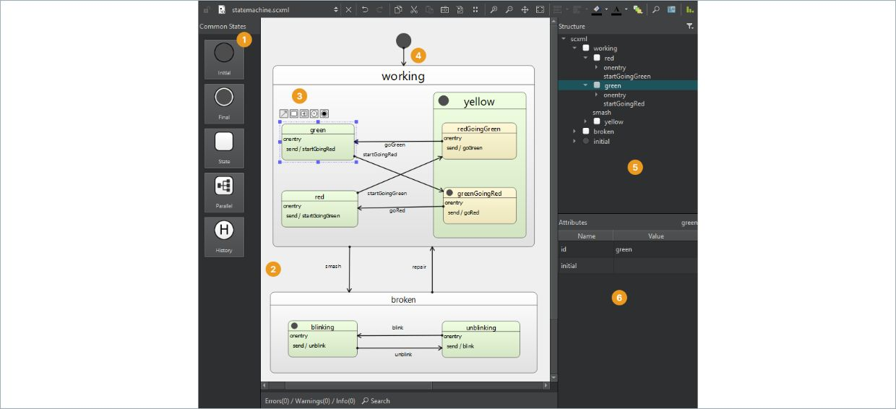
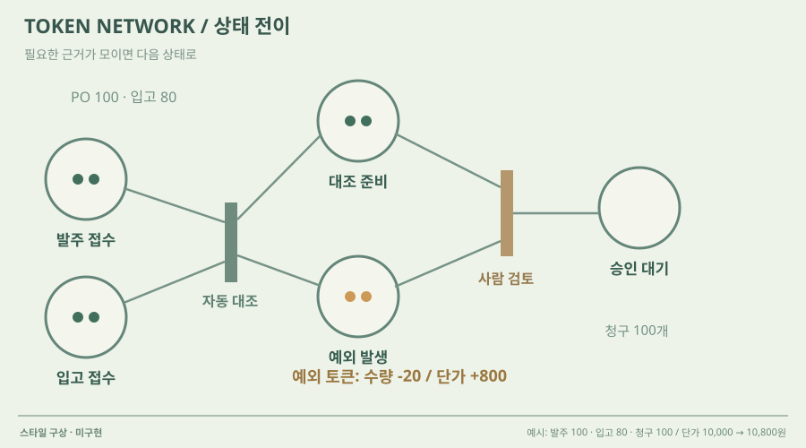

# UI 후보 20개 — 이미지와 설명

---

2026-10-09. 디자인 선택 자료이며 지원용 포트폴리오가 아닙니다. 실제 참고 화면·미구현 시안·최종 구현 화면을 구분합니다.

---

# 01 · 입체 미니어처 업무 공간

## 실제 참고 화면

- 원작: Grainworks · 업무 흐름이 보이는 미니어처
- [원본 출처](https://github.com/Kimhyuntae9665/grainworks-agent)
- 이미지 유형: 원격 미디어 파일 다운로드가 아닌 브라우저 표시 영역 캡처. 2026-10-09 보존.
- 분류: 공간
- 화면 설명: 입고·배합·검사·포장·창고를 공간과 물체 이동으로 이해하는 화면. 새 프로젝트의 구현 증거가 아닙니다.
- 시각 원리: 작업 구역과 대상 이동
- 어울리는 업무: 제조·물류·단계별 운영
- 재사용 기준: 실제 상태와 이동 경로가 있어야 함
- 원본 확인 기록: 공개 GitHub 저장소 트리·SHA·원본 캡처를 확인하고 브라우저에서 육안 확인. 기존 프로젝트 화면이며 새 구현 증거가 아닙니다.

## 프로젝트 적용 시안 — 미구현

- 적용 방향: 발주·입고·청구·검토를 공간의 작업대로 표현하고 같은 문서가 이동하는 경로를 보여줍니다.
- 조작 아이디어: 작업대나 문서를 선택해 증빙과 비교값을 열고, 조건 변경 뒤 보류 위치를 확인합니다.
- 선택 시 고려할 점: 공장 모양을 그대로 복제하면 업무와 어긋납니다. 입체감과 공간 중심 조작만 참고합니다.

이 SVG는 당시 동일한 합성 업무 예시를 비교하기 위한 구성 시안이다. 실제 조작·계산이 가능한 구현 화면으로 인용하지 않는다. 현재 구현 상태는 별도 `DECISIONS.md`와 `current-implementation/`을 확인한다.

---

# 02 · 3D 공간 + 상태 오버레이

## 실제 참고 화면

- 원작: NVIDIA Omniverse DSX — Thermal simulation
- [원본 출처](https://docs.omniverse.nvidia.com/dsx/latest/user-interface-walkthrough.html)
- 이미지 유형: 원격 미디어 파일 다운로드가 아닌 브라우저 표시 영역 캡처. 2026-10-09 보존.
- 분류: 공간
- 화면 설명: 데이터 홀의 3D 공간 위에 파랑에서 빨강으로 이어지는 온도 분포를 덮고, 설정 패널에서 구역·부하·변수를 바꾸는 화면.
- 시각 원리: 3D 공간 위의 상태 오버레이
- 어울리는 업무: 자원 부하·구역별 위험 비교
- 재사용 기준: 색의 단위·범례·계산 근거 필요
- 원본 확인 기록: official NVIDIA documentation verified; direct image HEAD 200, image/png

## 프로젝트 적용 시안 — 미구현

- 적용 방향: 작업 공간 위에 과부하·대기·오류 위치를 색으로 나타낸다. 색은 임의 지표가 아니라 실제 계산된 큐·오류·지연값에만 연결한다.
- 조작 아이디어: 부하 조건을 바꾸고 테스트를 실행해 오버레이의 전후 변화를 비교한다.
- 선택 시 고려할 점: 열 분포라는 은유는 이해가 빠르지만 의미를 임의로 부여하면 과장된다. 범례·단위·계산 기준을 보여야 한다.

이 SVG는 당시 동일한 합성 업무 예시를 비교하기 위한 구성 시안이다. 실제 조작·계산이 가능한 구현 화면으로 인용하지 않는다. 현재 구현 상태는 별도 `DECISIONS.md`와 `current-implementation/`을 확인한다.

---

# 03 · 넓게 내려다보는 물류 미니시티

## 실제 참고 화면

- 원작: Airsup Lab · Live Warehouse
- [원본 출처](https://www.airsup.ai/lab/warehouse)
- 이미지 유형: 원격 미디어 파일 다운로드가 아닌 브라우저 표시 영역 캡처. 2026-10-09 보존.
- 분류: 공간
- 화면 설명: 공식 웹 데모의 큰 3D 창고·도로·차량 장면. 왼쪽 업무 흐름, 오른쪽 선택 차량, 아래 배송 단계가 공간과 연결됩니다.
- 시각 원리: 넓은 전체 장면과 선택 대상 상세
- 어울리는 업무: 다수 개체·공정 간 대기·운송
- 재사용 기준: 큰 공간이 관계를 설명할 때 사용
- 원본 확인 기록: 2026-10-09 공식 웹 데모를 열어 창고 모형을 선택하고 로딩 뒤 실제 Live Warehouse 화면을 캡처·재열람했습니다. 연결된 X 원문 영상의 일부도 확인. 전체 기능·KPI 계산은 검증하지 않은 스타일 참고입니다.

## 프로젝트 적용 시안 — 미구현

- 적용 방향: 복잡한 업무 흐름을 넓은 작업 공간으로 배치하고 단계 사이 이동과 보류를 한 장면에서 관찰합니다.
- 조작 아이디어: 업무 구역을 선택해 문서의 이동과 막힌 이유를 열고 확대·축소합니다.
- 선택 시 고려할 점: 공간이 실제 업무의 이동·대기 관계를 설명할 때만 사용합니다. 참고 데모의 업무 영역·수치는 새 프로젝트로 복제하지 않습니다.

이 SVG는 당시 동일한 합성 업무 예시를 비교하기 위한 구성 시안이다. 실제 조작·계산이 가능한 구현 화면으로 인용하지 않는다. 현재 구현 상태는 별도 `DECISIONS.md`와 `current-implementation/`을 확인한다.

---

# 04 · 평면 배치 + 대상 인스펙터

## 실제 참고 화면

- 원작: CellForge · 공간 배치와 시간 재생
- [원본 출처](https://github.com/Kimhyuntae9665/cellforge)
- 이미지 유형: 원격 미디어 파일 다운로드가 아닌 브라우저 표시 영역 캡처. 2026-10-09 보존.
- 분류: 공간
- 화면 설명: 중앙의 큰 공장 모형, 왼쪽 입력, 오른쪽 대상 정보, 아래 시간축. 공개 저장소의 기존 구현 화면입니다.
- 시각 원리: 평면 배치와 주변 인스펙터
- 어울리는 업무: 설비 배치·개체 탐색·리플레이
- 재사용 기준: 주변 패널이 공간보다 커지지 않게
- 원본 확인 기록: 공개 GitHub 저장소 트리·SHA·원본 캡처를 확인하고 브라우저에서 육안 확인. 기존 프로젝트 화면이며 새 구현 증거가 아닙니다.

## 프로젝트 적용 시안 — 미구현

- 적용 방향: 업무 작업 공간을 평면 배치로 보여주고 선택한 문서와 단계의 상세값을 주변에서 확인합니다.
- 조작 아이디어: 문서를 선택하고 배치나 규칙을 바꾼 뒤 현재 상태와 실행 시간축을 확인합니다.
- 선택 시 고려할 점: 실제 공간 좌표가 없는 업무에는 역할 구역을 사용해야 합니다. 과도한 조작 패널을 줄입니다.

이 SVG는 당시 동일한 합성 업무 예시를 비교하기 위한 구성 시안이다. 실제 조작·계산이 가능한 구현 화면으로 인용하지 않는다. 현재 구현 상태는 별도 `DECISIONS.md`와 `current-implementation/`을 확인한다.

---

# 05 · 도형과 노선으로 읽는 업무 맵

## 실제 참고 화면

- 원작: Mini Metro — Gameplay screenshot
- [원본 출처](https://store.steampowered.com/app/287980/Mini_Metro/)
- 이미지 유형: 원격 미디어 파일 다운로드가 아닌 브라우저 표시 영역 캡처. 2026-10-09 보존.
- 분류: 흐름
- 화면 설명: 밝고 넓은 바탕에 역은 기하 도형, 노선은 단색 선으로 표시하는 2D 네트워크. 디테일을 줄여 연결·병목·용량에 시선이 모인다.
- 시각 원리: 기하 도형과 적은 색의 연결선
- 어울리는 업무: 단계 연결·병목·용량 조절
- 재사용 기준: 간결한 맵에서 상세 근거로 연결
- 원본 확인 기록: official Steam product page identifies developer/publisher and game; direct screenshot HEAD 200, image/jpeg; 갤러리에서 Week 3 선택 팝업 이미지 발견 후 공식 Steam 본문에서 실제 노선 지도 이미지로 교체·브라우저 육안 확인.

## 프로젝트 적용 시안 — 미구현

- 적용 방향: 업무 단계와 Agent를 역 모양으로 놓고 연결선 색으로 실행 경로를 보여 준다. 이 맵을 선택형 결과 비교의 시각 문법으로 참고한다.
- 조작 아이디어: 노선을 다시 연결하거나 제한된 도구 토큰을 재배치하고 대기열·실패 위치가 변하는 것을 본다.
- 선택 시 고려할 점: 간결함은 좋지만 실제 근거·정책·문서 내용을 지워버릴 수 있어 상세 결과 열람 경로가 필요하다.

이 SVG는 당시 동일한 합성 업무 예시를 비교하기 위한 구성 시안이다. 실제 조작·계산이 가능한 구현 화면으로 인용하지 않는다. 현재 구현 상태는 별도 `DECISIONS.md`와 `current-implementation/`을 확인한다.

---

# 06 · 컨베이어를 따라가는 문서 흐름

## 실제 참고 화면

- 원작: FACTORY I/O — From A to B scene
- [원본 출처](https://docs.factoryio.com/manual/scenes/)
- 이미지 유형: 원격 미디어 파일 다운로드가 아닌 브라우저 표시 영역 캡처. 2026-10-09 보존.
- 분류: 공간
- 화면 설명: 공식 장면 목록 중 From A to B 단일 캡처. 한 개의 상자와 컨베이어·센서가 놓인 넓은 3D 산업 장면으로, 축소된 썸네일 모음보다 장비 배치와 시점 구성이 크게 드러난다.
- 시각 원리: 단순 컨베이어와 이벤트
- 어울리는 업무: 입출력·순차 처리·센서 상태
- 재사용 기준: 산업 설비를 업무에 억지로 대응하지 않기
- 원본 확인 기록: official FACTORY I/O manual HTML references img/from-a-to-b.png; image HEAD 200, image/png

## 프로젝트 적용 시안 — 미구현

- 적용 방향: 업무 흐름을 한 개의 큰 작업 공간으로 보여 주고 선택한 단계에 해당하는 요청·도구·검증 상태를 공간 안의 설비처럼 표시한다.
- 조작 아이디어: 상자 이동/센서 도달 같은 이벤트를 실행·일시정지해 입력에서 결과까지 상태 전이를 확인한다.
- 선택 시 고려할 점: 공장 설비 은유가 실제 AX 업무와 자동으로 대응하지 않는다. 단계와 조작을 실제 업무 상태에 정확히 매핑해야 한다.

이 SVG는 당시 동일한 합성 업무 예시를 비교하기 위한 구성 시안이다. 실제 조작·계산이 가능한 구현 화면으로 인용하지 않는다. 현재 구현 상태는 별도 `DECISIONS.md`와 `current-implementation/`을 확인한다.

---

# 07 · 대기·분기를 보는 프로세스 모델

## 실제 참고 화면

- 원작: AnyLogic — Flowchart for the simulation model
- [원본 출처](https://www.anylogic.com/use-of-simulation/)
- 이미지 유형: 원격 미디어 파일 다운로드가 아닌 브라우저 표시 영역 캡처. 2026-10-09 보존.
- 분류: 흐름
- 화면 설명: 모델을 상자형 단계와 연결선으로 정의하는 플로차트. 현실 장면 대신 규칙과 분기 자체를 읽고 편집하게 한다.
- 시각 원리: 블록·분기·대기열
- 어울리는 업무: 처리 규칙·분기 설계·이산 사건 모델
- 재사용 기준: 실제 입출력 예시로 추상성 보완
- 원본 확인 기록: official AnyLogic article verified; direct image HEAD 200, image/webp

## 프로젝트 적용 시안 — 미구현

- 적용 방향: 프롬프트 → 검색/도구 호출 → 결과 검증 → 응답을 노드로 보여 주고 선택한 노드에서 실제 입출력과 근거를 확인한다.
- 조작 아이디어: 분기나 검증 단계를 삽입·삭제한 뒤 같은 업무 사례를 재생해 결과 변화 위치를 비교한다.
- 선택 시 고려할 점: 그래프는 비개발 사용자에게 추상적일 수 있으므로 실제 입력과 산출물을 함께 보여야 한다.

이 SVG는 당시 동일한 합성 업무 예시를 비교하기 위한 구성 시안이다. 실제 조작·계산이 가능한 구현 화면으로 인용하지 않는다. 현재 구현 상태는 별도 `DECISIONS.md`와 `current-implementation/`을 확인한다.

---

# 08 · 관제실처럼 보는 실행 타임라인

## 실제 참고 화면

- 원작: Chrome DevTools Performance — Page-load recording
- [원본 출처](https://developer.chrome.com/docs/devtools/performance/reference/)
- 이미지 유형: 원격 미디어 파일 다운로드가 아닌 브라우저 표시 영역 캡처. 2026-10-09 보존.
- 분류: 시간
- 화면 설명: Chrome 공식 문서의 실제 Performance 기록 화면. 상단 요약 타임라인과 여러 실행 트랙을 시간축에 정렬하고, Main 트랙의 중첩 flame chart로 호출과 하위 작업을 보여 준다.
- 시각 원리: 시간축과 중첩 실행 트랙
- 어울리는 업무: 동시 작업·호출 지연·병목 진단
- 재사용 기준: 개발 용어보다 작업명·역할명 사용
- 원본 확인 기록: official Chrome for Developers reference HTML labels the image A page-load recording and describes the Performance flame chart; image HEAD 200, image/png

## 프로젝트 적용 시안 — 미구현

- 적용 방향: 여러 Agent·도구·검증을 가로 시간축의 트랙으로 배치한다. 동시 실행 구간과 대기·완료 순서를 한 화면에서 비교한다.
- 조작 아이디어: 시간 구간을 드래그해 확대하고 이벤트를 선택하면 관련 입력·출력·검증 근거를 강조한다.
- 선택 시 고려할 점: 호출 스택 방식은 개발자에게 익숙하지만 일반 사용자는 읽기 어렵다. 트랙 이름은 사용자 역할과 작업명으로 바꾸고 계층 깊이는 제한한다.

이 SVG는 당시 동일한 합성 업무 예시를 비교하기 위한 구성 시안이다. 실제 조작·계산이 가능한 구현 화면으로 인용하지 않는다. 현재 구현 상태는 별도 `DECISIONS.md`와 `current-implementation/`을 확인한다.

---

# 09 · 변경 전후를 나란히 비교

## 실제 참고 화면

- 원작: Line Lens · 8시간 시나리오 비교
- [원본 출처](https://github.com/Kimhyuntae9665/line-lens)
- 이미지 유형: 원격 미디어 파일 다운로드가 아닌 브라우저 표시 영역 캡처. 2026-10-09 보존.
- 분류: 비교
- 화면 설명: 동일한 기간의 기준·변경 시나리오를 그래프와 결과표로 함께 비교하는 기존 공개 프로젝트 화면. 브라우저 원본을 직접 확인했습니다.
- 시각 원리: 같은 기간의 전후 결과
- 어울리는 업무: 조건 변경의 영향·정책 비교
- 재사용 기준: 같은 시드·기간·단위로 비교
- 원본 확인 기록: 공개 GitHub 저장소 트리·SHA·원본 캡처를 확인하고 브라우저에서 육안 확인. 기존 프로젝트 화면이며 새 구현 증거가 아닙니다.

## 프로젝트 적용 시안 — 미구현

- 적용 방향: 같은 증빙을 기준 규칙과 변경 규칙으로 처리한 결과를 나란히 두고 차이가 생긴 근거를 보여줍니다.
- 조작 아이디어: 조건을 하나 바꾼 뒤 두 실행을 비교하고 판정이 달라진 문서만 선택합니다.
- 선택 시 고려할 점: 비교 중심 화면으로는 유용하지만 공간 조작을 대신하지 않습니다. 표와 그래프는 보조 영역에 둡니다.

이 SVG는 당시 동일한 합성 업무 예시를 비교하기 위한 구성 시안이다. 실제 조작·계산이 가능한 구현 화면으로 인용하지 않는다. 현재 구현 상태는 별도 `DECISIONS.md`와 `current-implementation/`을 확인한다.

---

# 10 · 계측 장비처럼 보는 검증 트랙

## 실제 참고 화면

- 원작: Saleae Logic 2 · Timing Markers
- [원본 출처](https://www.saleae.com/support/logic-software/viewing-and-analyzing-data/measurements-timing-markers)
- 이미지 유형: 원격 미디어 파일 다운로드가 아닌 브라우저 표시 영역 캡처. 2026-10-09 보존.
- 분류: 시간
- 화면 설명: 공식 도움말의 타이밍 마커와 신호 트랙 화면. 어두운 바탕에 여러 채널과 선택 구간을 분리하는 계측 도구의 시각 문법.
- 시각 원리: 다중 채널과 구간 마커
- 어울리는 업무: 이벤트 대조·검증 기록·오류 시점
- 재사용 기준: 기록되지 않은 파형을 꾸미지 않기
- 원본 확인 기록: Saleae 공식 도움말과 직접 연결된 원본 PNG를 확인. 기술 계측 인터페이스의 스타일 참고.

## 프로젝트 적용 시안 — 미구현

- 적용 방향: 문서 필드별 검증 결과와 실행 이벤트를 트랙으로 나눠 어떤 조건에서 불일치가 생겼는지 보여줍니다.
- 조작 아이디어: 트랙과 구간을 선택해 관련 문서·기준값·실행 기록을 열고 전후 차이를 겹쳐 봅니다.
- 선택 시 고려할 점: 업무 데이터를 실제 전기 파형처럼 꾸미지 않습니다. 기록한 이벤트와 판정 상태에만 트랙을 연결합니다.

이 SVG는 당시 동일한 합성 업무 예시를 비교하기 위한 구성 시안이다. 실제 조작·계산이 가능한 구현 화면으로 인용하지 않는다. 현재 구현 상태는 별도 `DECISIONS.md`와 `current-implementation/`을 확인한다.

---

# 11 · 회로도처럼 잇는 검증 근거

## 실제 참고 화면

- 원작: Falstad CircuitJS · LRC 회로 시뮬레이터
- [원본 출처](https://www.falstad.com/circuit/)
- 이미지 유형: 원격 미디어 파일 다운로드가 아닌 브라우저 표시 영역 캡처. 2026-10-09 보존.
- 분류: 근거
- 화면 설명: 공식 회로 시뮬레이터에서 회로 기호·배선·물리량·조절값·파형을 함께 보여주는 실제 화면.
- 시각 원리: 기호·배선·변수 조절
- 어울리는 업무: 검증 근거의 의존 관계
- 재사용 기준: 회로 기호를 그대로 업무 용어로 치환하지 않기
- 원본 확인 기록: 2026-10-09 공식 페이지의 Full Screen version 링크로 들어가 실제 회로 화면을 열고 브라우저 캡처·재열람했습니다. 업무 은유의 참고이며 새 프로젝트 기능 검증이 아닙니다.

## 프로젝트 적용 시안 — 미구현

- 적용 방향: 원본 문서, 추출한 필드, 대조한 기준값을 회로 기호처럼 배치하고, 불일치가 생긴 필드에서 증빙 원본과 검증 결과로 선을 연결한다. 하단 파형 자리는 실제로 기록된 단계별 처리 이벤트를 표시하는 데 활용할 수 있다.
- 조작 아이디어: 문서 필드나 검증 규칙을 선택하면 관련 원문 위치와 계산 근거를 강조하고, 허용 오차를 바꾸면 해당 문서의 판정 상태를 다시 계산한다.
- 선택 시 고려할 점: 공학 기호와 파형은 정밀하고 신뢰감 있지만 회계 문서 검토와 비슷해 보이지 않을 수 있다. 금융 용어를 회로 기호로 억지 번역하지 말고 구조와 강조 방식만 참고한다.

이 SVG는 당시 동일한 합성 업무 예시를 비교하기 위한 구성 시안이다. 실제 조작·계산이 가능한 구현 화면으로 인용하지 않는다. 현재 구현 상태는 별도 `DECISIONS.md`와 `current-implementation/`을 확인한다.

---

# 12 · 분기·병렬 처리를 보는 업무 모식도

## 실제 참고 화면

- 원작: Camunda Web Modeler — Bake a Cake BPMN
- [원본 출처](https://docs.camunda.io/docs/components/modeler/bpmn/automating-a-process-using-bpmn/)
- 이미지 유형: 원격 미디어 파일 다운로드가 아닌 브라우저 표시 영역 캡처. 2026-10-09 보존.
- 분류: 흐름
- 화면 설명: Camunda 공식 BPMN 튜토리얼의 넓은 작업 캔버스. 시작·작업·분기·병렬 처리를 표준 기호로 놓고, 좌측 도구 팔레트와 상단 모드 전환이 캔버스에 붙어 있다.
- 시각 원리: 레인·분기·병렬·작업 토큰
- 어울리는 업무: 사람/자동화 책임 경계
- 재사용 기준: 현재 실행 경로 우선·전체도 분리
- 원본 확인 기록: 1차 출처: Camunda 공식 8 문서의 BPMN 튜토리얼. 이미지 URL은 출처가 본문에서 제공한 공식 PNG이며 HEAD HTTP 200, image/png 확인. 업무 요구의 증거가 아닌 참고 UI.

## 프로젝트 적용 시안 — 미구현

- 적용 방향: 문서 접수, AI 추출·대조, 사람의 추가자료 요청, 승인·반려, 가상 원장 기록을 역할별 가로 레인으로 나눈다. 사람이 개입해야 하는 경계와 자동 진행을 한 화면에서 구분한다.
- 조작 아이디어: 시나리오 실행 중인 작업 토큰을 현재 단계에 표시한다. 검토자가 보완자료를 추가하거나 승인·반려하면 토큰이 다음 단계로 이동하고 해당 문서 상태가 바뀐다.
- 선택 시 고려할 점: 단계와 책임 경계를 설명하기 좋지만 분기와 예외가 늘면 도식이 빽빽해진다. 현재 문서 한 건의 실행 경로를 우선 강조하고 전체 정의도는 별도로 둔다.

이 SVG는 당시 동일한 합성 업무 예시를 비교하기 위한 구성 시안이다. 실제 조작·계산이 가능한 구현 화면으로 인용하지 않는다. 현재 구현 상태는 별도 `DECISIONS.md`와 `current-implementation/`을 확인한다.

---

# 13 · 폭으로 읽는 문서 흐름

## 실제 참고 화면

- 원작: Flourish — Sankey animation example
- [원본 출처](https://public.flourish.studio/visualisation/487531/)
- 이미지 유형: 원격 미디어 파일 다운로드가 아닌 브라우저 표시 영역 캡처. 2026-10-09 보존.
- 분류: 흐름
- 화면 설명: Flourish 공개 Sankey 사례. 단계별 범주를 넓이가 달라지는 연결 띠로 이어 데이터가 어느 갈래로 얼마나 이동했는지 보여주는 흐름 중심 시각화다.
- 시각 원리: 분기별 건수를 연결 띠의 폭으로 표시
- 어울리는 업무: 처리 분포·누락·전환 비교
- 재사용 기준: 분모·단위·합성 여부 표시
- 원본 확인 기록: 1차 시각자료: Flourish가 호스팅하는 공개 Sankey 인터랙티브 사례. 페이지 HTTP 200, 썸네일 HEAD HTTP 200, image/jpeg 확인. 사례는 시각 형식 참고이며 회사 수요나 실제 성과 근거가 아니다.

## 프로젝트 적용 시안 — 미구현

- 적용 방향: 테스트 데이터에서 접수된 증빙 건수가 추출 성공, 불일치, 추가자료 요청, 승인, 보류로 어떻게 이동했는지 실제 건수로만 표현한다. 사용자가 흐름을 선택하면 해당 문서 목록을 연다.
- 조작 아이디어: 시나리오나 검증 기준을 바꾸면 전후 Sankey의 흐름 폭과 분기별 건수가 재계산된다. 각 흐름 클릭 시 표본 문서와 판정 이유를 보여준다.
- 선택 시 고려할 점: 전체 분포와 누락 구간을 직관적으로 보여주지만 소량 사례에서 흐름 폭 차이가 과장되어 보일 수 있다. 단위와 분모를 표시하고 합성 데이터는 데모값으로 명시해야 한다.

이 SVG는 당시 동일한 합성 업무 예시를 비교하기 위한 구성 시안이다. 실제 조작·계산이 가능한 구현 화면으로 인용하지 않는다. 현재 구현 상태는 별도 `DECISIONS.md`와 `current-implementation/`을 확인한다.

---

# 14 · 판정 근거를 잇는 관계 지도

## 실제 참고 화면

- 원작: Kumu — Systems Mapping canvas
- [원본 출처](https://www.kumu.io/)
- 이미지 유형: 원격 미디어 파일 다운로드가 아닌 브라우저 표시 영역 캡처. 2026-10-09 보존.
- 분류: 근거
- 화면 설명: Kumu 공식 제품 사이트의 시스템 맵 작업 화면. 여러 요소와 그 사이 관계를 자유 좌표에 배치하고 선으로 연결해 한 요소의 주변 맥락을 탐색하는 네트워크 지도 구조다.
- 시각 원리: 대상과 관계를 자유 좌표로 연결
- 어울리는 업무: 문서 계보·판정 원인·관계 탐색
- 재사용 기준: 관련 경로만 열어 선의 혼잡 줄이기
- 원본 확인 기록: 1차 출처: Kumu 공식 제품 웹사이트. 이미지 URL은 공식 자산 도메인의 제품 스크린샷이며 HEAD HTTP 200, image/jpeg 확인. 관계 맵 형식 참고용이다.

## 프로젝트 적용 시안 — 미구현

- 적용 방향: 원본 영수증·송장, 추출된 날짜·금액·거래처, 적용 기준, 불일치 이유를 노드로 두고 실제 검토 근거를 선으로 잇는다. 연결된 자료만 강조해 판정이 어떤 근거에서 나왔는지 추적한다.
- 조작 아이디어: 불일치 노드를 선택하면 연결된 원본 영역과 규칙, 추가자료 요청, 승인 기록을 하이라이트한다. 필터로 문서·필드·담당자 유형을 좁힌다.
- 선택 시 고려할 점: 증빙 계보를 넓게 볼 수 있지만 모든 필드를 연결하면 선이 엉켜 읽기 어렵다. 한 판정과 관련된 경로만 단계별로 열고 관계 유형을 최소화한다.

이 SVG는 당시 동일한 합성 업무 예시를 비교하기 위한 구성 시안이다. 실제 조작·계산이 가능한 구현 화면으로 인용하지 않는다. 현재 구현 상태는 별도 `DECISIONS.md`와 `current-implementation/`을 확인한다.

---

# 15 · 상태와 전이를 보는 검토 머신

## 실제 참고 화면

- 원작: Qt Creator · SCXML 상태 편집기
- [원본 출처](https://doc.qt.io/qtcreator/creator-scxml.html)
- 이미지 유형: 원격 미디어 파일 다운로드가 아닌 브라우저 표시 영역 캡처. 2026-10-09 보존.
- 분류: 흐름
- 화면 설명: Qt 공식 문서의 실제 상태 편집기 화면. 여러 상태와 전이선, 왼쪽 상태 종류, 오른쪽 구조·속성 정보를 함께 보여줍니다.
- 시각 원리: 명시적 상태와 허용 전이
- 어울리는 업무: 승인·반려·재시도·복구
- 재사용 기준: 가능/불가능 전이를 실제 규칙과 일치
- 원본 확인 기록: Qt Creator 공식 SCXML 문서가 직접 연결한 SCXML editor 원본 이미지. 기존 Stately 예제의 만화 캐릭터 요소를 제외하고 기술 모식도 스타일을 비교하기 위해 선정했습니다.

## 프로젝트 적용 시안 — 미구현

- 적용 방향: 접수, 필드 추출, 대조, 보완 대기, 승인, 반려, 원장 반영 상태를 구분하고 허용 이벤트에 따른 전이를 그린다. 활성 상태와 선택된 전이를 강조해 문서 검토 한 건의 현재 위치와 가능한 다음 조치를 동시에 읽는다.
- 조작 아이디어: 시뮬레이션에서 보완 자료 수신, 승인, 반려 이벤트를 순서대로 발생시켜 활성 상태가 이동하는 모습을 관찰한다. 전이를 선택해 필요한 근거와 검증 규칙을 상세 패널에서 확인하고 초기 상태로 되돌려 다른 경로를 비교한다.
- 선택 시 고려할 점: 상태와 전이를 정확히 설명하기 좋지만 기술 편집기처럼 복잡해질 수 있습니다. 업무 단계에 필요한 상태와 연결만 강조해야 합니다.

이 SVG는 당시 동일한 합성 업무 예시를 비교하기 위한 구성 시안이다. 실제 조작·계산이 가능한 구현 화면으로 인용하지 않는다. 현재 구현 상태는 별도 `DECISIONS.md`와 `current-implementation/`을 확인한다.

---

# 16 · 기술 화이트보드와 주석

## 실제 참고 화면

- 원작: Excalidraw — GitHub README product showcase
- [원본 출처](https://github.com/excalidraw/excalidraw/blob/master/README.md)
- 이미지 유형: 원격 미디어 파일 다운로드가 아닌 브라우저 표시 영역 캡처. 2026-10-09 보존.
- 분류: 설명
- 화면 설명: Excalidraw 공식 README의 Product showcase 이미지. 브라우저 안 실제 화이트보드 편집 화면에 손그림 스타일의 웹페이지 와이어프레임, 주석 화살표, 선택 영역, 색상·선 스타일 패널, 협업 사용자 표시가 함께 보인다.
- 시각 원리: 화이트보드·주석·자유 배치
- 어울리는 업무: 문제 정의·설계 설명·협업
- 재사용 기준: 손그림 표현과 실제 제품 기능을 구분
- 원본 확인 기록: 1차 출처: Excalidraw 공식 GitHub README가 Product showcase로 직접 삽입한 이미지. 브라우저에서 원본 이미지를 열어 실제 편집기와 와이어프레임·주석·도구 패널을 육안 확인했다. 로고 OG 배너가 아니다.

## 프로젝트 적용 시안 — 미구현

- 적용 방향: 원본 문서, 추출 필드, 검토 메모, 불일치 연결을 자유 배치하되 각 주석이 어떤 근거를 가리키는지 선과 라벨로 표시한다. 고정된 단계 흐름보다 여러 증거 간 관계를 설명하는 장면에 쓴다.
- 조작 아이디어: 카드나 주석을 끌어 위치를 바꾸고, 화살표를 연결하거나 색을 바꿔 근거 관계를 직접 구성한다. 특정 필드 주석을 선택하면 원문 인용과 검토 메모를 연다.
- 선택 시 고려할 점: 관계를 빠르게 스케치하고 협업 설명을 붙이기 좋지만 정렬·규칙 일관성은 사용자가 관리해야 한다. 감사 가능한 정형 단계 표현이나 자동 처리 순서의 유일한 근거로 쓰지는 않는다.

이 SVG는 당시 동일한 합성 업무 예시를 비교하기 위한 구성 시안이다. 실제 조작·계산이 가능한 구현 화면으로 인용하지 않는다. 현재 구현 상태는 별도 `DECISIONS.md`와 `current-implementation/`을 확인한다.

---

# 17 · 도구 실행을 펼치는 노드 캔버스

## 실제 참고 화면

- 원작: n8n — Build your first workflow editor screenshot
- [원본 출처](https://github.com/n8n-io/n8n-docs/blob/main/docs/get-started/build-your-first-workflow.md)
- 이미지 유형: 원격 미디어 파일 다운로드가 아닌 브라우저 표시 영역 캡처. 2026-10-09 보존.
- 분류: 흐름
- 화면 설명: n8n 공식 문서의 실제 워크플로 편집기 캡처. 상단 Editor·Executions 탭과 하단 Test workflow 버튼, 중앙 Schedule Trigger → NASA → If 노드 및 true/false 경로의 PostBin 요청 노드 두 개가 보인다. 여러 연결 노드와 분기 구조가 채워진 편집 캔버스다.
- 시각 원리: 도구 노드와 실행 경로
- 어울리는 업무: Agent·자동화·도구 입출력
- 재사용 기준: 노드 수보다 결과와 오류 원인 강조
- 원본 확인 기록: 1차 출처: n8n 공식 첫 워크플로 문서가 사용하는 이미지 자산. 문서 원본 Markdown과 저장소의 자산 경로를 확인하고 브라우저에서 이미지를 직접 열어 다중 노드 편집 UI를 육안 확인했다. 실제 실행 완료/결과 오버레이 캡처는 아니다.

## 프로젝트 적용 시안 — 미구현

- 적용 방향: 문서 입력, 필드 추출, 규칙 대조, 사람 검토, 가상 원장 기록을 단계별 노드로 보여준다. 선택한 단계의 입력·출력을 확인해 자동 처리와 사람 판단의 경계를 설명한다.
- 조작 아이디어: 노드를 선택해 단계별 입출력 데이터를 열고, 테스트 입력이나 분기 기준을 바꿔 어느 경로로 진행되는지 확인한다. 실패한 단계만 재실행하고 뒤 단계의 결과 차이를 비교한다.
- 선택 시 고려할 점: 분기와 단계 순서를 제품 편집기 안에서 빠르게 읽을 수 있지만 노드가 늘수록 배선도가 복잡해진다. 이 공식 캡처는 다중 노드 편집 화면이며 완료된 실행의 노드별 결과 오버레이는 보여주지 않는다. 실행 결과 스타일의 근거로 확대 해석하지 않는다.

이 SVG는 당시 동일한 합성 업무 예시를 비교하기 위한 구성 시안이다. 실제 조작·계산이 가능한 구현 화면으로 인용하지 않는다. 현재 구현 상태는 별도 `DECISIONS.md`와 `current-implementation/`을 확인한다.

---

# 18 · 모식도를 조작하며 따라가는 설명

## 실제 참고 화면

- 원작: Bartosz Ciechanowski · GPS
- [원본 출처](https://ciechanow.ski/gps/)
- 이미지 유형: 원격 미디어 파일 다운로드가 아닌 브라우저 표시 영역 캡처. 2026-10-09 보존.
- 분류: 설명
- 화면 설명: 저자가 직접 만든 인터랙티브 설명. 짧은 본문 아래 3D 공간과 2D 모식도가 연결되고, 장면을 따라 원리를 단계적으로 설명합니다.
- 시각 원리: 조작하는 모식도와 짧은 설명
- 어울리는 업무: 메커니즘·입력과 결과의 인과관계
- 재사용 기준: 설명과 실제 모델의 한계를 함께 제시
- 원본 확인 기록: 저자 공식 사이트의 GPS 설명을 직접 열어 Simple Positioning 구역의 3D·2D 연결 화면을 브라우저에서 캡처·육안 확인했습니다. 과학 설명 문법을 참고하며 GPS 기술을 새 앱 기능으로 주장하지 않습니다.

## 프로젝트 적용 시안 — 미구현

- 적용 방향: 문서가 어떤 값으로 읽히고 어떤 근거에서 판정이 달라지는지 조작 가능한 짧은 장면으로 설명합니다.
- 조작 아이디어: 한 단계씩 진행하면서 대상 필드와 원본 영역을 강조하고, 조건을 바꿔 전후 결과를 같은 장면에서 비교합니다.
- 선택 시 고려할 점: 업무를 배우거나 포트폴리오를 설명할 때 유용하지만 대량 처리에는 별도의 검토 목록이 필요합니다.

이 SVG는 당시 동일한 합성 업무 예시를 비교하기 위한 구성 시안이다. 실제 조작·계산이 가능한 구현 화면으로 인용하지 않는다. 현재 구현 상태는 별도 `DECISIONS.md`와 `current-implementation/`을 확인한다.

---

# 19 · 근거 층을 펼치는 기술 분해도

## 실제 참고 화면

- 원작: Onshape — Exploded Views
- [원본 출처](https://cad.onshape.com/help/Content/Assembly/exploded_views.htm)
- 이미지 유형: 원격 미디어 파일 다운로드가 아닌 브라우저 표시 영역 캡처. 2026-10-09 보존.
- 분류: 근거
- 화면 설명: Onshape 공식 도움말의 분해 조립 편집기 스크린샷. 3D 조립품에서 부품을 떨어뜨려 배치하고, 분해선과 편집 중 상태를 패널에서 함께 보여주는 기술 설계도형 화면이다.
- 시각 원리: 구성 요소를 떨어뜨린 분해도
- 어울리는 업무: 원문·추출·규칙·판정의 책임 분리
- 재사용 기준: 깊이감은 근거 계층을 설명할 때만
- 원본 확인 기록: 1차 출처: Onshape 공식 Exploded Views 도움말. 직접 연결된 이미지 HEAD HTTP 200, image/png 확인. 공식 제품의 실제 편집 화면이며 다른 회사의 요구나 구현 완료를 입증하지 않는다.

## 프로젝트 적용 시안 — 미구현

- 적용 방향: 송장이나 영수증을 층별 문서처럼 시각화할 때 원본 페이지, 추출 필드, 정규화값, 판정 사유를 서로 분리해 근거가 쌓이는 순서를 보여준다. 실제 문서 처리 순서를 기준으로 층을 펼친다.
- 조작 아이디어: 층을 한 단계씩 펼치거나 되감으면 해당 단계에서 추가된 값과 근거만 드러난다. 원본의 특정 필드 층을 선택해 추출·대조·사람 수정 이력을 비교한다.
- 선택 시 고려할 점: 구성 요소의 관계와 분리 과정을 강하게 보여주지만, 평면 문서에 3D를 그대로 쓰면 장식처럼 느껴질 수 있다. 깊이감은 실제 근거 계층이 설명을 돕는 경우에만 적용한다.

이 SVG는 당시 동일한 합성 업무 예시를 비교하기 위한 구성 시안이다. 실제 조작·계산이 가능한 구현 화면으로 인용하지 않는다. 현재 구현 상태는 별도 `DECISIONS.md`와 `current-implementation/`을 확인한다.

---

# 20 · 설명과 조작이 붙은 실험 노트

## 실제 참고 화면

- 원작: Distill — How to Use t-SNE Effectively
- [원본 출처](https://distill.pub/2016/misread-tsne/)
- 이미지 유형: 원격 미디어 파일 다운로드가 아닌 브라우저 표시 영역 캡처. 2026-10-09 보존.
- 분류: 설명
- 화면 설명: Distill의 연구 설명 글은 본문과 인터랙티브 그림을 엮어 독자가 입력값을 바꾸며 결과 변화와 해석의 한계를 직접 확인하게 한다. 하나의 완성 대시보드보다 설명과 조작이 번갈아 이어지는 구성이다.
- 시각 원리: 본문과 인터랙티브 실험
- 어울리는 업무: 사용자 학습·파라미터 민감도
- 재사용 기준: 운영 화면보다 튜토리얼·실험에 적합
- 원본 확인 기록: Distill 저자 제작 인터랙티브 설명을 브라우저에서 직접 확인·캡처했습니다. 합성 예시 조작과 본문이 결합된 형식을 참고하며 회사 수요 근거가 아닙니다.

## 프로젝트 적용 시안 — 미구현

- 적용 방향: 거래일 허용 범위, 금액 차이 기준 같은 검증 조건을 직접 바꾸고 문서별 일치·불일치 결과가 어떻게 달라지는지 설명과 함께 탐색한다. 바뀐 판정과 근거를 나란히 보여준다.
- 조작 아이디어: 사용자가 기준 슬라이더를 움직이면 대상 문서의 비교 결과가 즉시 갱신되고, 결과의 의미와 한계가 옆 설명에서 바뀐다. 원래 기준과 수정 기준의 판정을 함께 보존한다.
- 선택 시 고려할 점: 조건과 결과의 관계를 학습시키는 데 강하지만 여러 문서를 동시에 운영하는 업무 화면으로는 느리고 서사적이다. 튜토리얼·실험 모드에 적합하다.

이 SVG는 당시 동일한 합성 업무 예시를 비교하기 위한 구성 시안이다. 실제 조작·계산이 가능한 구현 화면으로 인용하지 않는다. 현재 구현 상태는 별도 `DECISIONS.md`와 `current-implementation/`을 확인한다.
