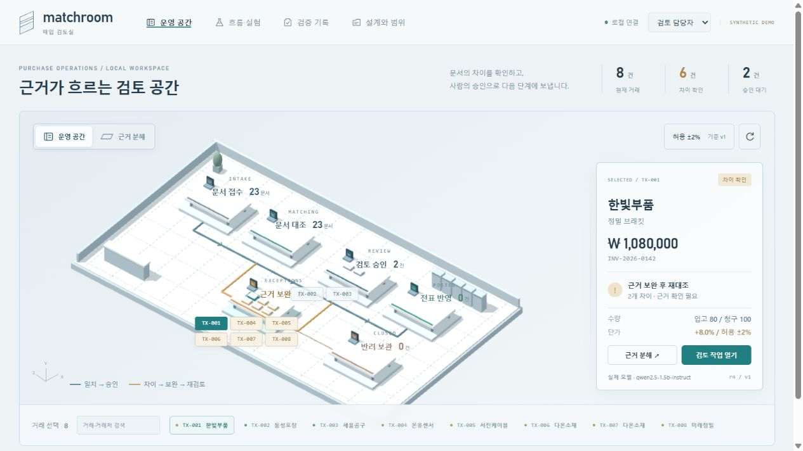
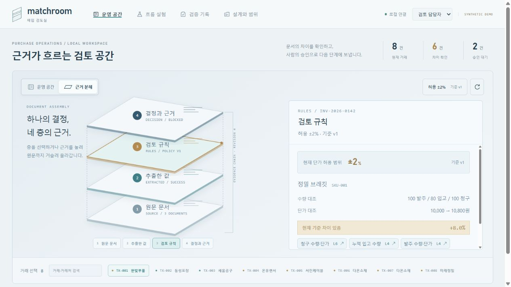
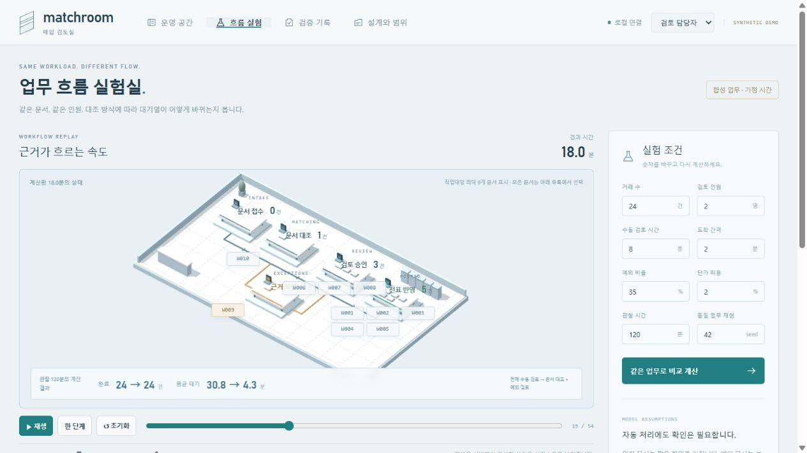

# 03·05·19 선택과 최종 구현

사용자 확인: “03의 공간감, 05의 간결한 흐름, 19의 기술적인 분해 방식”. 세 제품의 화면을 합성·복사하는 대신 서로 다른 역할에 해당 표현 원리를 사용했다.

| 후보 | 가져온 원리 | Matchroom에 구현한 부분 |
| --- | --- | --- |
| 03 Airsup | 넓게 내려다보는 전체 장면, 위치와 상태의 연결 | Three.js 운영 공간에 문서 접수·대조·보완·승인·전표·반려 구역 배치, 실제 거래 선택·상세 확인 |
| 05 Mini Metro | 적은 도형·선·색으로 연결 경로 읽기 | 단계 연결과 보완 경로를 간단히 표현, 흐름 실험의 실제 대기열·완료 상태를 공간에 연결 |
| 19 Onshape | 부품 분해로 각 구성의 관계 설명 | 원문 → 추출값 → 규칙 → 결정의 네 층, 해당 필드·근거 원문 행 탐색 |

## 최종 실행 화면

공간에서 거래를 선택하고 입고80/청구100·단가8% 차이와 다음 행동을 확인한다.

모델 추출과 규칙 판정·사람의 승인 경계를 분리하고 원문 근거를 연다.

동일 합성 입력의 기준/대조 흐름을 비교하고 검토자 수 등 조건을 바꾸면 계산된 대기시간·완료량이 달라진다.

이 화면은 20개 참고 원작이나 미구현 SVG와 달리 현재 프로젝트의 실행 캡처다. 합성 문서, 로컬 Qwen 추출, 코드 규칙, 사람 승인, 가상 전표를 연결한 데모이며 실제 ERP·고객 운영·현장 성과가 아니다. 업무시간은 시뮬레이션 가정이다.

## 재사용할 때 유지할 기준

- 화면의 주인공은 업무 대상과 상태다. 패널과 차트는 선택 대상·결과를 설명하는 용도로 둔다.
- 장면의 위치·이동·색은 실제 상태·계산과 연결한다.
- 기본 장면은 전체 흐름, 선택 상세는 현재 문제와 다음 행동, 분해도는 근거와 책임을 설명한다.
- 넓은 화면과 깊이감이 작은 글자·조작 불편을 만들면 먼저 줄인다. 여러 표현을 한 화면에 모두 쌓지 않는다.
- 다음 프로젝트에서도 03·05·19를 강제하지 않는다. 시간·관계·교육 중심 과업이라면 다른 후보를 다시 비교한다.

이 저장소에는 디자인 적용 사례의 실제 실행 캡처만 포함했다. 실행 앱이나 백엔드 전체가 포함된 저장소는 아니다. 시안·참고·실행 화면을 구분하는 사례로 활용한다.
