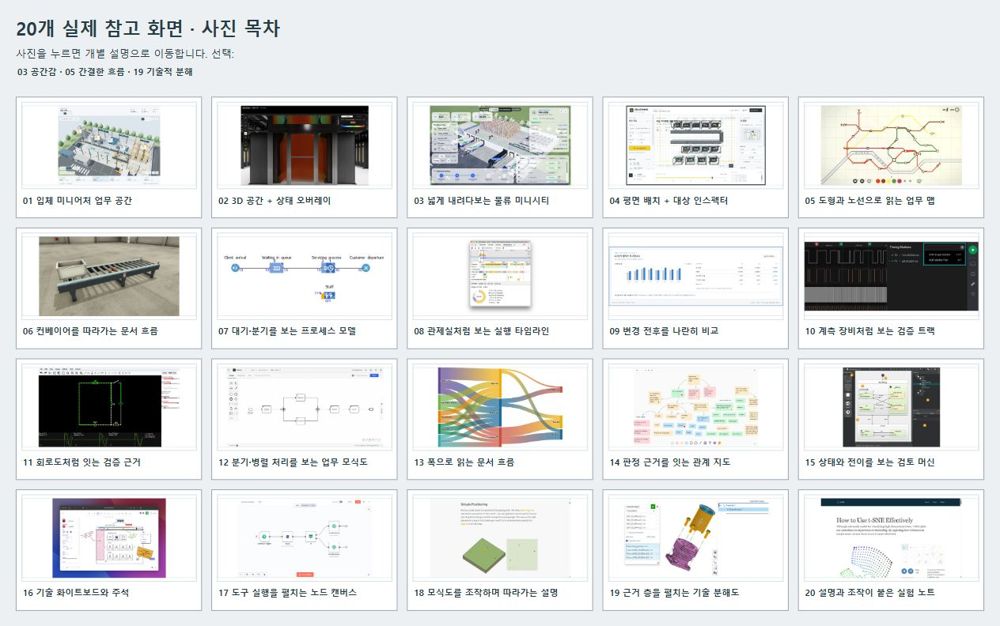

# UI Reference Kit — 사진과 설명으로 고르는 20가지 화면 방향

**공간 모형·흐름도·시간축·근거 지도·인터랙티브 설명을 비교하고, 내 프로젝트에 맞는 UI 방향을 고르는 참고 라이브러리입니다.**

일반 대시보드 외의 구성을 찾을 때 사용할 수 있습니다. 실제 참고 화면 20개에 설명·출처·적용 아이디어·조작 방식·주의점을 붙이고, 동일한 업무 예시로 만든 SVG 시안 20개와 선택 갤러리를 함께 제공합니다.

**설치 없이 사진 책자를 볼 수 있고, Python만 있으면 선택 갤러리를 실행할 수 있습니다.** 디자인 도구·Node.js·API 키·LLM은 필요하지 않습니다.



> **English overview:** A Korean-first library of 20 UI directions: spatial scenes, process maps, timelines, comparisons, evidence graphs, and interactive explainers. Includes attributed reference screenshots, annotated notes, original SVG design studies, a browsable catalog, and an interactive selection gallery. Download the repository ZIP and open `index.html`; no build or API keys required. Original code, documentation, and SVG studies are MIT-licensed. Reference screenshots have separate rights; see [NOTICE.md](NOTICE.md).

## 1. 처음 사용하는 분은 여기부터

### Git을 몰라도 사용할 수 있습니다

1. [ZIP 다운로드](https://github.com/Kimhyuntae9665/ui-reference-kit/archive/refs/heads/main.zip)를 누르고 압축을 풉니다. GitHub의 **Code → Download ZIP**으로도 받을 수 있습니다.
2. 압축을 푼 폴더에서 **`index.html`을 더블클릭**합니다. 사진·설명·분류 필터가 있는 책자가 브라우저에서 열립니다.
3. `OVERVIEW.html`은 20개 사진을 한눈에 비교하는 목차입니다. 사진을 누르면 책자의 해당 후보 설명으로 이동합니다.
4. 책자에서 **공간 / 흐름 / 시간 / 비교 / 근거 / 설명**을 골라 후보를 좁힙니다. 이미지를 누르면 개별 JPG를 크게 볼 수 있습니다.
5. ‘당시 프로젝트 적용 시안 보기 · 미구현’을 펼치면 같은 스타일을 업무 예시에 적용한 SVG가 보입니다.

사진과 설명은 모두 저장소에 포함돼 있어 인터넷 없이 읽을 수 있습니다. 외부 원본 출처를 열 때만 인터넷이 필요합니다. GitHub의 HTML 파일 페이지는 소스 코드 보기이므로, 책자를 보려면 ZIP을 내려받거나 로컬 서버를 실행하세요.

### Git을 사용한다면

```bash
git clone https://github.com/Kimhyuntae9665/ui-reference-kit.git
cd ui-reference-kit
```

이후 `index.html`을 열면 됩니다. 선택 기능까지 사용하려면 다음 절을 따라주세요.

## 2. 최대 3개를 고르는 선택 갤러리

압축을 푼 폴더에서 터미널을 열어 다음 명령을 실행합니다.

```bash
python -m http.server 5176 --bind 127.0.0.1
```

환경에 따라 Windows에서는 `py -m http.server 5176 --bind 127.0.0.1`, macOS/Linux에서는 `python3 -m http.server 5176 --bind 127.0.0.1`을 사용합니다.

브라우저에서 [http://127.0.0.1:5176/gallery/index.html](http://127.0.0.1:5176/gallery/index.html)을 엽니다.

| 조작 | 무엇을 할 수 있나요? |
| --- | --- |
| 20개 전체 / 01–05 … 16–20 | 모든 후보 또는 5개 묶음으로 비교 |
| 실제 참고 화면 / 프로젝트 적용 구상 | 원작 캡처와 새 SVG 시안을 구분해서 보기 |
| 사진 클릭 | 확대 화면, 출처, 적용 방향, 조작 아이디어, 단점 읽기 |
| 이 방향 선택 | 후보 최대 3개 선택 |
| 선택한 방향 | 고른 후보만 모아 비교 |
| 선택 해제 | 후보를 바꾸거나 초기 선택으로 돌아가기 |

선택은 해당 브라우저의 `localStorage`에만 저장됩니다. 로그인·업로드·외부 전송은 없습니다. 다른 사람이나 AI 세션에 선택을 전달할 때는 **번호와 가져올 원리**를 함께 알려주세요. 예: “03 공간감 + 05 간결한 흐름 + 19 기술적 분해”.

서버 종료는 터미널에서 **Ctrl+C**입니다. 포트가 사용 중이면 `5177` 등 다른 포트로 실행하고 주소도 바꿉니다.

## 3. 20개 후보 목록

번호를 누르면 사진·출처·자세한 설명이 있는 Markdown 문서를 읽을 수 있습니다.

| 번호 | 화면 방향 | 참고 원작 | 분류 |
| --- | --- | --- | --- |
| [01](candidates/01.md) | 입체 미니어처 업무 공간 | Grainworks | 공간 |
| [02](candidates/02.md) | 3D 공간 + 상태 오버레이 | NVIDIA Omniverse DSX | 공간 |
| [03](candidates/03.md) | 넓게 내려다보는 물류 미니시티 | Airsup Live Warehouse | 공간 |
| [04](candidates/04.md) | 평면 배치 + 대상 인스펙터 | CellForge | 공간 |
| [05](candidates/05.md) | 도형과 노선으로 읽는 업무 맵 | Mini Metro | 흐름 |
| [06](candidates/06.md) | 컨베이어를 따라가는 문서 흐름 | FACTORY I/O | 공간 |
| [07](candidates/07.md) | 대기·분기를 보는 프로세스 모델 | AnyLogic | 흐름 |
| [08](candidates/08.md) | 관제실처럼 보는 실행 타임라인 | Chrome DevTools Performance | 시간 |
| [09](candidates/09.md) | 변경 전후를 나란히 비교 | Line Lens | 비교 |
| [10](candidates/10.md) | 계측 장비처럼 보는 검증 트랙 | Saleae Logic 2 | 시간 |
| [11](candidates/11.md) | 회로도처럼 잇는 검증 근거 | Falstad CircuitJS | 근거 |
| [12](candidates/12.md) | 분기·병렬 처리를 보는 업무 모식도 | Camunda BPMN | 흐름 |
| [13](candidates/13.md) | 폭으로 읽는 문서 흐름 | Flourish Sankey | 흐름 |
| [14](candidates/14.md) | 판정 근거를 잇는 관계 지도 | Kumu | 근거 |
| [15](candidates/15.md) | 상태와 전이를 보는 검토 머신 | Qt SCXML Editor | 흐름 |
| [16](candidates/16.md) | 기술 화이트보드와 주석 | Excalidraw | 설명 |
| [17](candidates/17.md) | 도구 실행을 펼치는 노드 캔버스 | n8n | 흐름 |
| [18](candidates/18.md) | 모식도를 조작하며 따라가는 설명 | Bartosz Ciechanowski GPS | 설명 |
| [19](candidates/19.md) | 근거 층을 펼치는 기술 분해도 | Onshape Exploded Views | 근거 |
| [20](candidates/20.md) | 설명과 조작이 붙은 실험 노트 | Distill t-SNE | 설명 |

각 후보에는 **화면 설명 → 시각 원리 → 적합한 업무 → 재사용 기준 → 프로젝트 적용 → 조작 아이디어 → 주의점 → 확인 수준**이 있습니다. 전체를 한 번에 읽으려면 [CATALOG.md](CATALOG.md)를 이용하세요.

## 4. 내 프로젝트에 맞게 활용하는 방법

먼저 “예쁜 화면”보다 **사용자가 내려야 하는 결정**을 적어보세요.

1. **사용자:** 누구의 작업 화면인가요?
2. **결정:** 무엇을 선택·승인·조절·비교하나요?
3. **입력과 규칙:** 어떤 데이터·제약·판정 기준이 있나요?
4. **상태 변화:** 입력을 바꾸면 어떤 대상의 상태가 달라지나요?
5. **결과:** 병목·대기·오류·근거·전후 차이 중 무엇을 관찰하나요?

그다음 아래 기준으로 방향을 좁힙니다.

| 보여주려는 내용 | 먼저 볼 후보 |
| --- | --- |
| 대상이 어디에 있고 어느 단계에서 막히는가 | 01·03·04·06 |
| 부하·위험이 어느 구역에 집중되는가 | 02 |
| 연결·분기·사람과 자동화의 역할은 무엇인가 | 05·07·12·15·17 |
| 어떤 작업이 기다렸고 어느 시점에 실패했는가 | 08·10 |
| 조건 하나를 바꾸면 결과가 어떻게 달라지는가 | 09·13 |
| 판정은 어떤 문서·필드·규칙에 근거하는가 | 11·14·19 |
| 사용자가 원리와 한계를 직접 이해하게 하려면 | 16·18·20 |

최대 3개에서 **가져올 원리와 버릴 요소**를 적고, 같은 작은 업무 예시로 화면을 구성해 보세요. 업무 상태·계산과 연결되지 않은 이동이나 임의 KPI를 실제 시뮬레이션으로 설명하지 않습니다.

## 5. AI·Codex·다른 세션에 전달하기

다른 세션이 자동으로 이 자료를 기억하는 것은 아닙니다. 저장소를 클론한 경로를 알려주거나 필요한 파일을 첨부해 주세요.

```text
첨부한 ui-reference-kit 또는 로컬 클론 폴더를 참고해 UI 방향을 정해 주세요.
README.md, HOW_IT_WAS_MADE.md, manifest.json을 먼저 읽고,
관련 후보의 candidates/NN.md, images/NN-reference.jpg,
concepts/NN-concept.svg를 직접 확인하세요.

대상 사용자: [누가 사용하는가]
핵심 결정: [무엇을 판단·조절하는가]
입력과 규칙: [데이터·제약·판정 기준]
상태와 결과: [무엇이 바뀌고 무엇을 관찰하는가]

20개 중 적합한 3개와 이유, 가져올 원리, 버릴 요소,
대표 화면 구성과 핵심 조작 흐름을 제안해 주세요.
실제 참고 화면·미구현 시안·최종 실행 캡처를 구분하세요.
기존 예시의 도메인과 03·05·19 선택을 자동 적용하지 마세요.
```

더 많은 예시는 [NEW_SESSION_PROMPT.md](NEW_SESSION_PROMPT.md)에 있습니다. `manifest.json`은 ID·분류·로컬 이미지·시안·원본 URL·선택 여부를 포함하는 Agent용 데이터입니다. **메타데이터만 읽고 사진을 확인했다고 판단하지 않도록** 이미지 경로도 함께 제공합니다.

## 6. 참고 화면과 시안은 어떻게 다른가요?

| 자료 | 의미 |
| --- | --- |
| `images/NN-reference.jpg` | 원작 제품·프로젝트가 브라우저에 표시된 실제 화면의 캡처 |
| `concepts/NN-concept.svg` | 같은 합성 업무 예시로 새로 구성한 디자인 시안. 미구현 |
| `current-implementation/` | 선택한 원리를 후속 데모에 적용한 실제 실행 캡처. 앱 전체 소스는 포함하지 않음 |

20개 SVG는 예시 수량 **발주100 / 입고80 / 청구100**, 단가 **10,000원 / 10,800원**을 동일하게 사용해 구성 방식만 비교했습니다. 회사 운영 성과나 원작 제품의 성능을 나타내는 값이 아닙니다.

적용 사례는 **03 공간감 + 05 간결한 흐름 + 19 기술적 분해**입니다. 이 조합으로 운영 공간·흐름 실험·네 층의 근거 보기를 만들었습니다. 선택 이유와 실제 캡처는 [DECISIONS.md](DECISIONS.md)에 있습니다. 이 선택을 모든 프로젝트의 정답으로 제시하지 않습니다.

## 7. 폴더 구조

```text
ui-reference-kit/
├── README.md                  # 시작 안내
├── index.html                 # 사진·설명 책자, 서버 없이 열기
├── OVERVIEW.html              # 20개 사진 목차
├── overview.jpg               # README 미리보기
├── candidates/01.md … 20.md    # 후보별 설명·출처
├── images/01-reference.jpg …   # 실제 참고 화면 캡처
├── concepts/01-concept.svg …   # 자체 SVG 시안
├── gallery/                   # 선택 갤러리 HTML/CSS/JS
├── current-implementation/    # 후속 실행 사례 캡처
├── manifest.json              # Agent용 구조화 데이터
├── scenes.json                # 시안 SVG와 설명 데이터
├── CATALOG.md                 # 전체 후보 설명
├── HOW_IT_WAS_MADE.md          # 수집·선정·제작 방법
├── NEW_SESSION_PROMPT.md       # 재사용 요청 예시
├── CONTRIBUTING.md            # 새 후보·설명 추가 방법
├── NOTICE.md                  # 원작·캡처·라이선스 구분
└── scripts/validate.py         # 개수·링크·SVG 검수
```

## 8. 문제 해결

| 증상 | 해결 |
| --- | --- |
| GitHub에서 HTML 코드만 보입니다 | ZIP을 내려받아 압축을 풀고 `index.html`을 여세요. |
| 책자 이미지가 안 보입니다 | HTML 파일 하나만 옮기지 말고 `images/`·`concepts/`가 포함된 폴더 전체를 유지하세요. |
| 선택 갤러리에 실제 참고 화면이 안 뜹니다 | `file://`로 열지 말고 로컬 서버를 실행한 뒤 `/gallery/index.html`로 접속하세요. |
| `python`을 찾을 수 없습니다 | `py` 또는 `python3`를 시도하세요. 서버 없이 `index.html`만 보는 것은 가능합니다. |
| `Address already in use`가 나옵니다 | 다른 서비스는 종료하지 말고 포트를 바꾸세요. |
| 다른 브라우저에서 선택이 사라집니다 | 선택은 브라우저별 저장입니다. 번호를 따로 기록해 전달하세요. |
| 원작의 작은 글자가 읽기 어렵습니다 | 개별 JPG 또는 후보에 연결된 원본 출처를 확인하세요. 캡처는 원본 미디어 파일이 아닙니다. |

## 9. 수정·기여·검수

수집·구성 과정을 반복하려면 [HOW_IT_WAS_MADE.md](HOW_IT_WAS_MADE.md)를, 후보를 추가하거나 오류를 고치려면 [CONTRIBUTING.md](CONTRIBUTING.md)를 읽어주세요. 출처·정확한 설명·권리 구분을 함께 유지합니다.

```bash
python scripts/validate.py
```

Python 표준 라이브러리만 사용해 후보 ID·이미지·설명·SVG·로컬 링크·메타데이터를 검사합니다. 실행 환경에 따라 `py` 또는 `python3`로 바꾸면 됩니다.

## 10. 라이선스와 출처

**자체 코드·문서·SVG 시안은 [MIT License](LICENSE)로 재사용할 수 있습니다.** 외부 제품·사이트의 참고 캡처와 로고는 해당 권리자에게 귀속되며 MIT 적용 대상이 아닙니다. `images/`, `overview.jpg`, `current-implementation/`의 캡처 권리는 [NOTICE.md](NOTICE.md)에서 별도로 안내합니다.

각 후보의 원작과 직접 출처는 [출처 목록](SOURCES.md)과 후보별 문서에 있습니다. 이 저장소는 정보 배치와 조작 원리를 비교하는 자료이며, 원작 제품과의 제휴·승인·성능 보증을 의미하지 않습니다.

제작: [Kimhyuntae9665](https://github.com/Kimhyuntae9665). 디자인 요구·후보 선택을 바탕으로 AI Agent의 조사·정리·코드 제작 도움을 받아 구성했습니다. 초기 참고 확인일: 2026-10-09.
