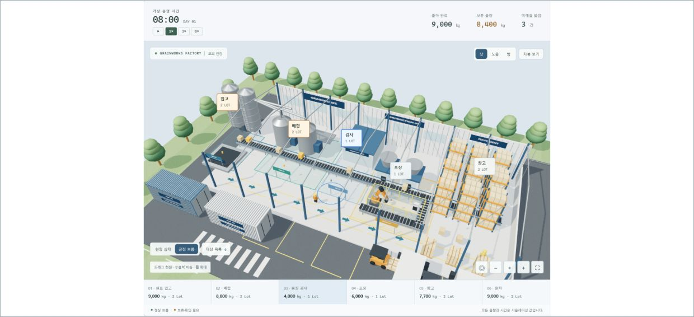
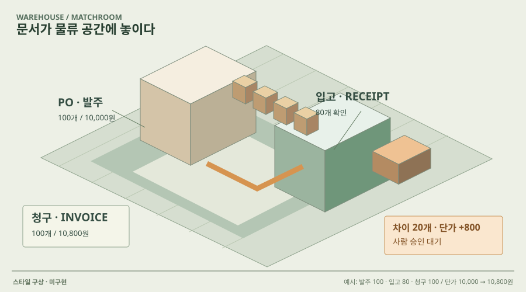

# 01 · 입체 미니어처 업무 공간

## 실제 참고 화면

- 원작: Grainworks · 업무 흐름이 보이는 미니어처
- [원본 출처](https://github.com/Kimhyuntae9665/grainworks-agent)
- 이미지 유형: browser_render_screenshot · 2026-10-09 보존.
- 분류: 공간
- 화면 설명: 입고·배합·검사·포장·창고를 공간과 물체 이동으로 이해하는 화면. 새 프로젝트의 구현 증거가 아닙니다.
- 시각 원리: 작업 구역과 대상 이동
- 어울리는 업무: 제조·물류·단계별 운영
- 재사용 기준: 실제 상태와 이동 경로가 있어야 함
- 원본 확인 기록: 공개 GitHub 저장소 트리·SHA·원본 캡처를 확인하고 브라우저에서 육안 확인. 기존 프로젝트 화면이며 새 구현 증거가 아닙니다.

## 프로젝트 적용 시안 — 미구현

- 적용 방향: 발주·입고·청구·검토를 공간의 작업대로 표현하고 같은 문서가 이동하는 경로를 보여줍니다.
- 조작 아이디어: 작업대나 문서를 선택해 증빙과 비교값을 열고, 조건 변경 뒤 보류 위치를 확인합니다.
- 선택 시 고려할 점: 공장 모양을 그대로 복제하면 업무와 어긋납니다. 입체감과 공간 중심 조작만 참고합니다.

이 SVG는 합성 업무 예시를 비교하기 위한 구성 시안입니다. 실제 조작·계산이 가능한 구현 화면으로 인용하지 않습니다. 현재 구현 상태는 [DECISIONS.md](../DECISIONS.md)를 확인하세요.
