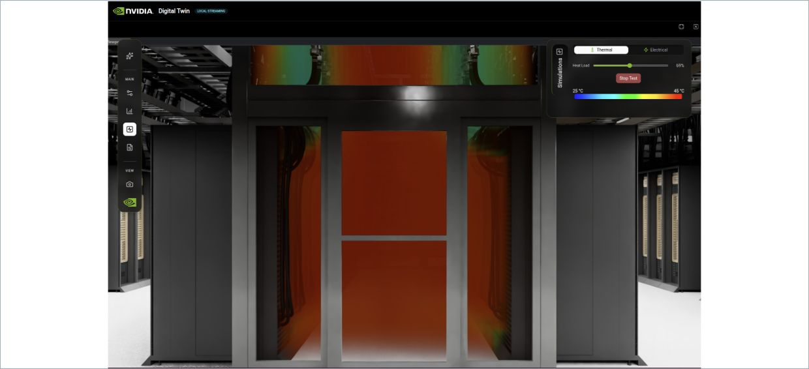
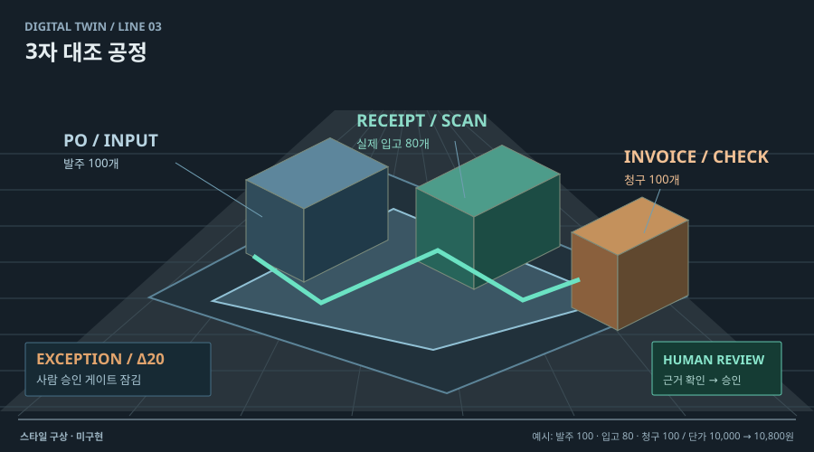

# 02 · 3D 공간 + 상태 오버레이

## 실제 참고 화면

- 원작: NVIDIA Omniverse DSX — Thermal simulation
- [원본 출처](https://docs.omniverse.nvidia.com/dsx/latest/user-interface-walkthrough.html)
- 이미지 유형: browser_render_screenshot · 2026-10-09 보존.
- 분류: 공간
- 화면 설명: 데이터 홀의 3D 공간 위에 파랑에서 빨강으로 이어지는 온도 분포를 덮고, 설정 패널에서 구역·부하·변수를 바꾸는 화면.
- 시각 원리: 3D 공간 위의 상태 오버레이
- 어울리는 업무: 자원 부하·구역별 위험 비교
- 재사용 기준: 색의 단위·범례·계산 근거 필요
- 원본 확인 기록: official NVIDIA documentation verified; direct image HEAD 200, image/png

## 프로젝트 적용 시안 — 미구현

- 적용 방향: 작업 공간 위에 과부하·대기·오류 위치를 색으로 나타낸다. 색은 임의 지표가 아니라 실제 계산된 큐·오류·지연값에만 연결한다.
- 조작 아이디어: 부하 조건을 바꾸고 테스트를 실행해 오버레이의 전후 변화를 비교한다.
- 선택 시 고려할 점: 열 분포라는 은유는 이해가 빠르지만 의미를 임의로 부여하면 과장된다. 범례·단위·계산 기준을 보여야 한다.

이 SVG는 합성 업무 예시를 비교하기 위한 구성 시안입니다. 실제 조작·계산이 가능한 구현 화면으로 인용하지 않습니다. 현재 구현 상태는 [DECISIONS.md](../DECISIONS.md)를 확인하세요.
