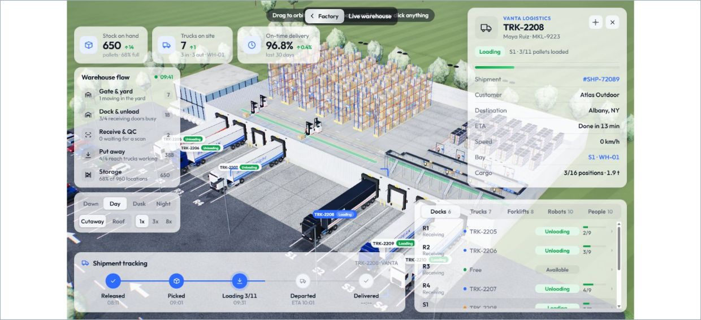
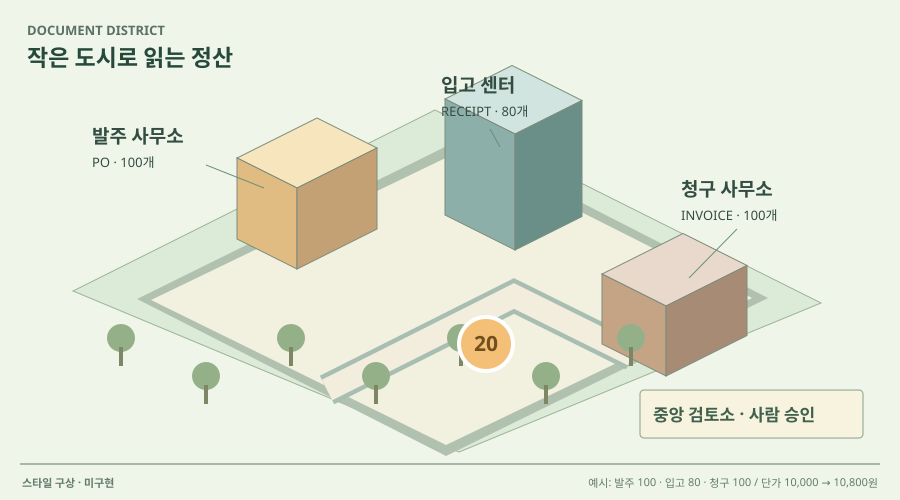

# 03 · 넓게 내려다보는 물류 미니시티

## 실제 참고 화면

- 원작: Airsup Lab · Live Warehouse
- [원본 출처](https://www.airsup.ai/lab/warehouse)
- 이미지 유형: 원격 미디어 파일 다운로드가 아닌 브라우저 표시 영역 캡처. 2026-10-09 보존.
- 분류: 공간
- 화면 설명: 공식 웹 데모의 큰 3D 창고·도로·차량 장면. 왼쪽 업무 흐름, 오른쪽 선택 차량, 아래 배송 단계가 공간과 연결됩니다.
- 시각 원리: 넓은 전체 장면과 선택 대상 상세
- 어울리는 업무: 다수 개체·공정 간 대기·운송
- 재사용 기준: 큰 공간이 관계를 설명할 때 사용
- 원본 확인 기록: 2026-10-09 공식 웹 데모를 열어 창고 모형을 선택하고 로딩 뒤 실제 Live Warehouse 화면을 캡처·재열람했습니다. 연결된 X 원문 영상의 일부도 확인. 전체 기능·KPI 계산은 검증하지 않은 스타일 참고입니다.

## 프로젝트 적용 시안 — 미구현

- 적용 방향: 복잡한 업무 흐름을 넓은 작업 공간으로 배치하고 단계 사이 이동과 보류를 한 장면에서 관찰합니다.
- 조작 아이디어: 업무 구역을 선택해 문서의 이동과 막힌 이유를 열고 확대·축소합니다.
- 선택 시 고려할 점: 공간이 실제 업무의 이동·대기 관계를 설명할 때만 사용합니다. 참고 데모의 업무 영역·수치는 새 프로젝트로 복제하지 않습니다.

이 SVG는 당시 동일한 합성 업무 예시를 비교하기 위한 구성 시안이다. 실제 조작·계산이 가능한 구현 화면으로 인용하지 않는다. 현재 구현 상태는 별도 `DECISIONS.md`와 `current-implementation/`을 확인한다.
