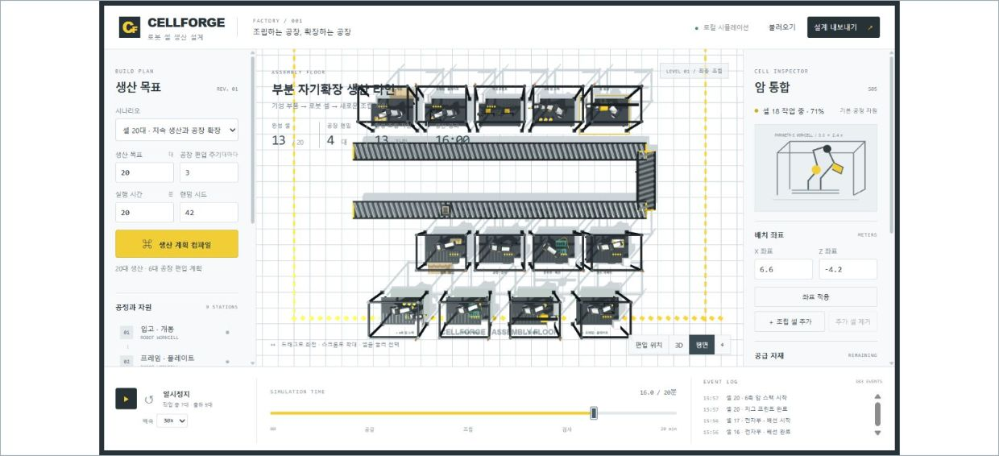
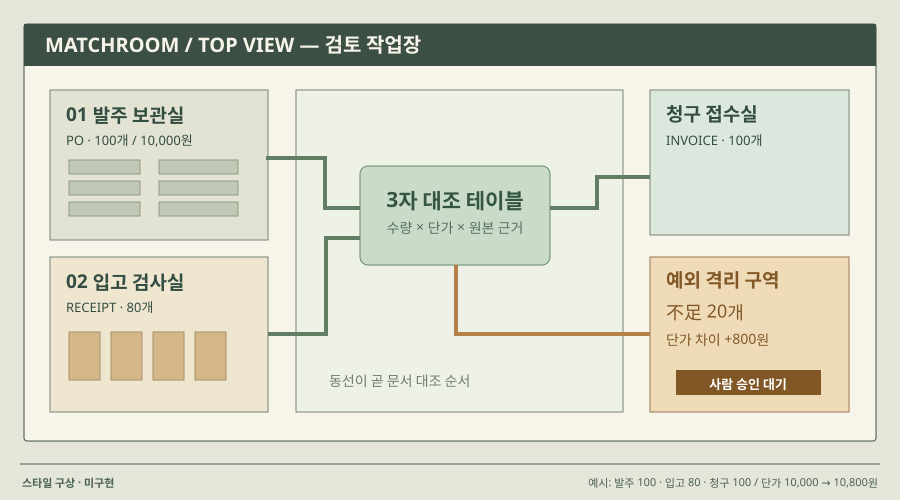

# 04 · 평면 배치 + 대상 인스펙터

## 실제 참고 화면

- 원작: CellForge · 공간 배치와 시간 재생
- [원본 출처](https://github.com/Kimhyuntae9665/cellforge)
- 이미지 유형: browser_render_screenshot · 2026-10-09 보존.
- 분류: 공간
- 화면 설명: 중앙의 큰 공장 모형, 왼쪽 입력, 오른쪽 대상 정보, 아래 시간축. 공개 저장소의 기존 구현 화면입니다.
- 시각 원리: 평면 배치와 주변 인스펙터
- 어울리는 업무: 설비 배치·개체 탐색·리플레이
- 재사용 기준: 주변 패널이 공간보다 커지지 않게
- 원본 확인 기록: 공개 GitHub 저장소 트리·SHA·원본 캡처를 확인하고 브라우저에서 육안 확인. 기존 프로젝트 화면이며 새 구현 증거가 아닙니다.

## 프로젝트 적용 시안 — 미구현

- 적용 방향: 업무 작업 공간을 평면 배치로 보여주고 선택한 문서와 단계의 상세값을 주변에서 확인합니다.
- 조작 아이디어: 문서를 선택하고 배치나 규칙을 바꾼 뒤 현재 상태와 실행 시간축을 확인합니다.
- 선택 시 고려할 점: 실제 공간 좌표가 없는 업무에는 역할 구역을 사용해야 합니다. 과도한 조작 패널을 줄입니다.

이 SVG는 합성 업무 예시를 비교하기 위한 구성 시안입니다. 실제 조작·계산이 가능한 구현 화면으로 인용하지 않습니다. 현재 구현 상태는 [DECISIONS.md](../DECISIONS.md)를 확인하세요.
