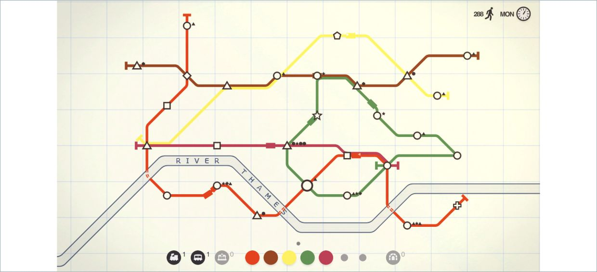
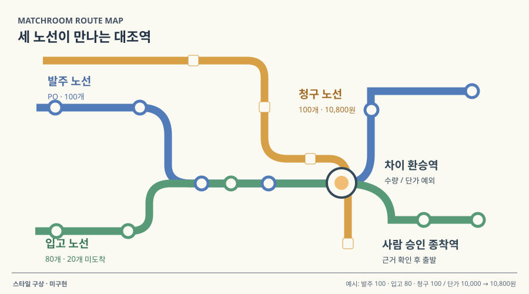

# 05 · 도형과 노선으로 읽는 업무 맵

## 실제 참고 화면

- 원작: Mini Metro — Gameplay screenshot
- [원본 출처](https://store.steampowered.com/app/287980/Mini_Metro/)
- 이미지 유형: browser_render_screenshot · 2026-10-09 보존.
- 분류: 흐름
- 화면 설명: 밝고 넓은 바탕에 역은 기하 도형, 노선은 단색 선으로 표시하는 2D 네트워크. 디테일을 줄여 연결·병목·용량에 시선이 모인다.
- 시각 원리: 기하 도형과 적은 색의 연결선
- 어울리는 업무: 단계 연결·병목·용량 조절
- 재사용 기준: 간결한 맵에서 상세 근거로 연결
- 원본 확인 기록: official Steam product page identifies developer/publisher and game; direct screenshot HEAD 200, image/jpeg; 갤러리에서 Week 3 선택 팝업 이미지 발견 후 공식 Steam 본문에서 실제 노선 지도 이미지로 교체·브라우저 육안 확인.

## 프로젝트 적용 시안 — 미구현

- 적용 방향: 업무 단계와 Agent를 역 모양으로 놓고 연결선 색으로 실행 경로를 보여 준다. 이 맵을 선택형 결과 비교의 시각 문법으로 참고한다.
- 조작 아이디어: 노선을 다시 연결하거나 제한된 도구 토큰을 재배치하고 대기열·실패 위치가 변하는 것을 본다.
- 선택 시 고려할 점: 간결함은 좋지만 실제 근거·정책·문서 내용을 지워버릴 수 있어 상세 결과 열람 경로가 필요하다.

이 SVG는 합성 업무 예시를 비교하기 위한 구성 시안입니다. 실제 조작·계산이 가능한 구현 화면으로 인용하지 않습니다. 현재 구현 상태는 [DECISIONS.md](../DECISIONS.md)를 확인하세요.
