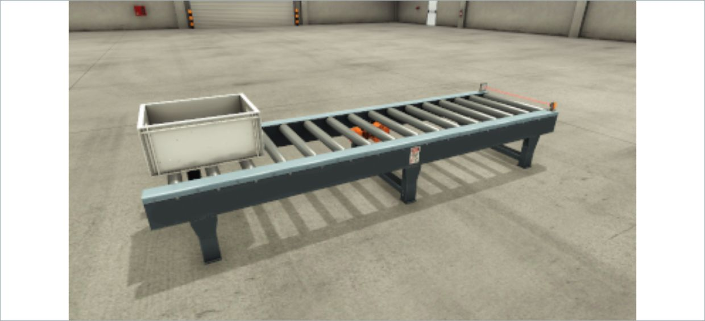
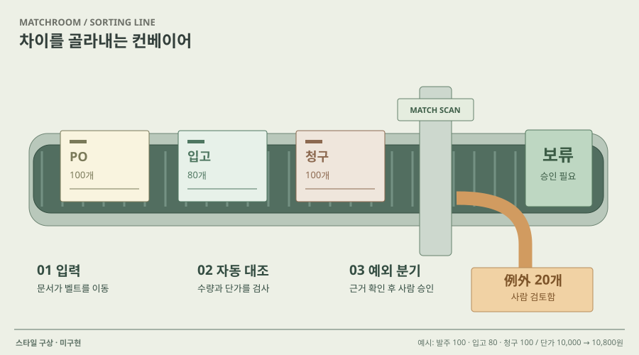

# 06 · 컨베이어를 따라가는 문서 흐름

## 실제 참고 화면

- 원작: FACTORY I/O — From A to B scene
- [원본 출처](https://docs.factoryio.com/manual/scenes/)
- 이미지 유형: browser_render_screenshot · 2026-10-09 보존.
- 분류: 공간
- 화면 설명: 공식 장면 목록 중 From A to B 단일 캡처. 한 개의 상자와 컨베이어·센서가 놓인 넓은 3D 산업 장면으로, 축소된 썸네일 모음보다 장비 배치와 시점 구성이 크게 드러난다.
- 시각 원리: 단순 컨베이어와 이벤트
- 어울리는 업무: 입출력·순차 처리·센서 상태
- 재사용 기준: 산업 설비를 업무에 억지로 대응하지 않기
- 원본 확인 기록: official FACTORY I/O manual HTML references img/from-a-to-b.png; image HEAD 200, image/png

## 프로젝트 적용 시안 — 미구현

- 적용 방향: 업무 흐름을 한 개의 큰 작업 공간으로 보여 주고 선택한 단계에 해당하는 요청·도구·검증 상태를 공간 안의 설비처럼 표시한다.
- 조작 아이디어: 상자 이동/센서 도달 같은 이벤트를 실행·일시정지해 입력에서 결과까지 상태 전이를 확인한다.
- 선택 시 고려할 점: 공장 설비 은유가 실제 AX 업무와 자동으로 대응하지 않는다. 단계와 조작을 실제 업무 상태에 정확히 매핑해야 한다.

이 SVG는 합성 업무 예시를 비교하기 위한 구성 시안입니다. 실제 조작·계산이 가능한 구현 화면으로 인용하지 않습니다. 현재 구현 상태는 [DECISIONS.md](../DECISIONS.md)를 확인하세요.
