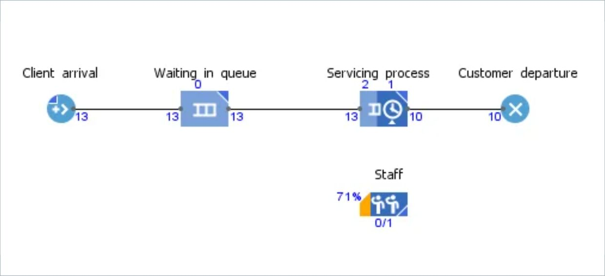
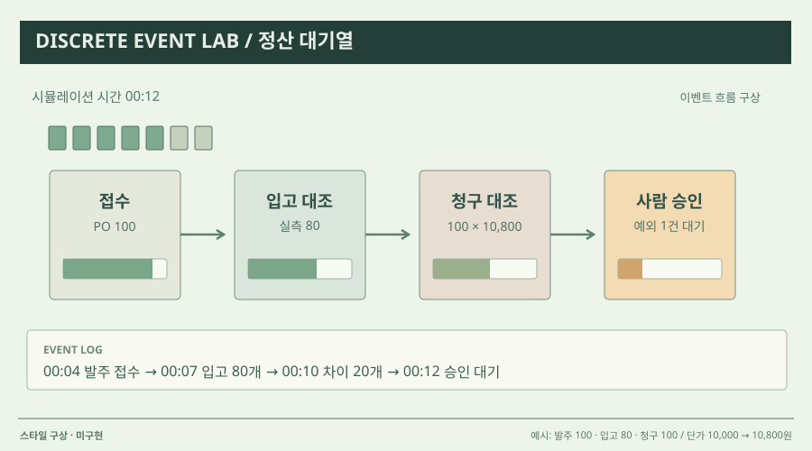

# 07 · 대기·분기를 보는 프로세스 모델

## 실제 참고 화면

- 원작: AnyLogic — Flowchart for the simulation model
- [원본 출처](https://www.anylogic.com/use-of-simulation/)
- 이미지 유형: browser_render_screenshot · 2026-10-09 보존.
- 분류: 흐름
- 화면 설명: 모델을 상자형 단계와 연결선으로 정의하는 플로차트. 현실 장면 대신 규칙과 분기 자체를 읽고 편집하게 한다.
- 시각 원리: 블록·분기·대기열
- 어울리는 업무: 처리 규칙·분기 설계·이산 사건 모델
- 재사용 기준: 실제 입출력 예시로 추상성 보완
- 원본 확인 기록: official AnyLogic article verified; direct image HEAD 200, image/webp

## 프로젝트 적용 시안 — 미구현

- 적용 방향: 프롬프트 → 검색/도구 호출 → 결과 검증 → 응답을 노드로 보여 주고 선택한 노드에서 실제 입출력과 근거를 확인한다.
- 조작 아이디어: 분기나 검증 단계를 삽입·삭제한 뒤 같은 업무 사례를 재생해 결과 변화 위치를 비교한다.
- 선택 시 고려할 점: 그래프는 비개발 사용자에게 추상적일 수 있으므로 실제 입력과 산출물을 함께 보여야 한다.

이 SVG는 합성 업무 예시를 비교하기 위한 구성 시안입니다. 실제 조작·계산이 가능한 구현 화면으로 인용하지 않습니다. 현재 구현 상태는 [DECISIONS.md](../DECISIONS.md)를 확인하세요.
