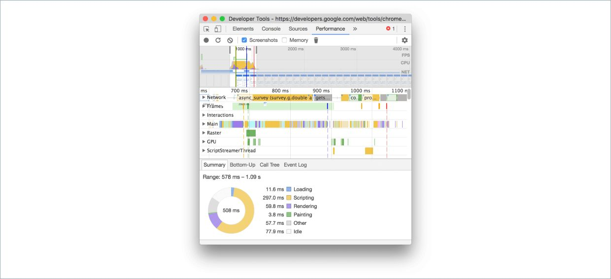
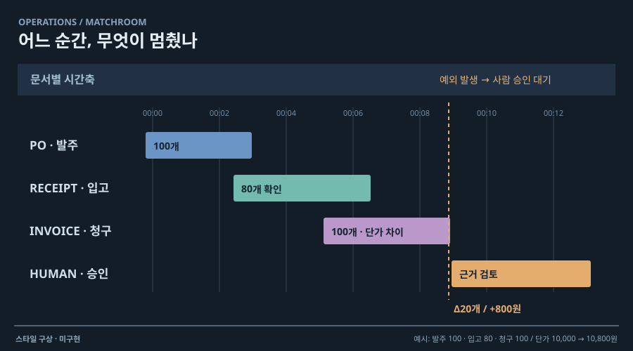

# 08 · 관제실처럼 보는 실행 타임라인

## 실제 참고 화면

- 원작: Chrome DevTools Performance — Page-load recording
- [원본 출처](https://developer.chrome.com/docs/devtools/performance/reference/)
- 이미지 유형: browser_render_screenshot · 2026-10-09 보존.
- 분류: 시간
- 화면 설명: Chrome 공식 문서의 실제 Performance 기록 화면. 상단 요약 타임라인과 여러 실행 트랙을 시간축에 정렬하고, Main 트랙의 중첩 flame chart로 호출과 하위 작업을 보여 준다.
- 시각 원리: 시간축과 중첩 실행 트랙
- 어울리는 업무: 동시 작업·호출 지연·병목 진단
- 재사용 기준: 개발 용어보다 작업명·역할명 사용
- 원본 확인 기록: official Chrome for Developers reference HTML labels the image A page-load recording and describes the Performance flame chart; image HEAD 200, image/png

## 프로젝트 적용 시안 — 미구현

- 적용 방향: 여러 Agent·도구·검증을 가로 시간축의 트랙으로 배치한다. 동시 실행 구간과 대기·완료 순서를 한 화면에서 비교한다.
- 조작 아이디어: 시간 구간을 드래그해 확대하고 이벤트를 선택하면 관련 입력·출력·검증 근거를 강조한다.
- 선택 시 고려할 점: 호출 스택 방식은 개발자에게 익숙하지만 일반 사용자는 읽기 어렵다. 트랙 이름은 사용자 역할과 작업명으로 바꾸고 계층 깊이는 제한한다.

이 SVG는 합성 업무 예시를 비교하기 위한 구성 시안입니다. 실제 조작·계산이 가능한 구현 화면으로 인용하지 않습니다. 현재 구현 상태는 [DECISIONS.md](../DECISIONS.md)를 확인하세요.
