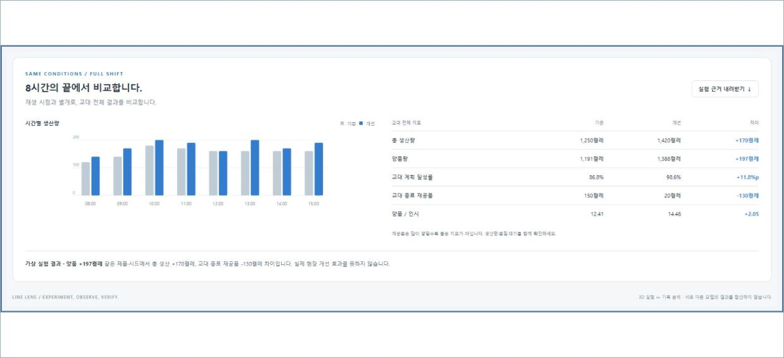
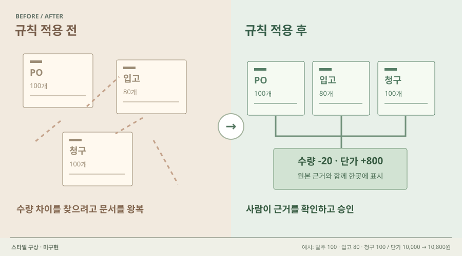

# 09 · 변경 전후를 나란히 비교

## 실제 참고 화면

- 원작: Line Lens · 8시간 시나리오 비교
- [원본 출처](https://github.com/Kimhyuntae9665/line-lens)
- 이미지 유형: 원격 미디어 파일 다운로드가 아닌 브라우저 표시 영역 캡처. 2026-10-09 보존.
- 분류: 비교
- 화면 설명: 동일한 기간의 기준·변경 시나리오를 그래프와 결과표로 함께 비교하는 기존 공개 프로젝트 화면. 브라우저 원본을 직접 확인했습니다.
- 시각 원리: 같은 기간의 전후 결과
- 어울리는 업무: 조건 변경의 영향·정책 비교
- 재사용 기준: 같은 시드·기간·단위로 비교
- 원본 확인 기록: 공개 GitHub 저장소 트리·SHA·원본 캡처를 확인하고 브라우저에서 육안 확인. 기존 프로젝트 화면이며 새 구현 증거가 아닙니다.

## 프로젝트 적용 시안 — 미구현

- 적용 방향: 같은 증빙을 기준 규칙과 변경 규칙으로 처리한 결과를 나란히 두고 차이가 생긴 근거를 보여줍니다.
- 조작 아이디어: 조건을 하나 바꾼 뒤 두 실행을 비교하고 판정이 달라진 문서만 선택합니다.
- 선택 시 고려할 점: 비교 중심 화면으로는 유용하지만 공간 조작을 대신하지 않습니다. 표와 그래프는 보조 영역에 둡니다.

이 SVG는 당시 동일한 합성 업무 예시를 비교하기 위한 구성 시안이다. 실제 조작·계산이 가능한 구현 화면으로 인용하지 않는다. 현재 구현 상태는 별도 `DECISIONS.md`와 `current-implementation/`을 확인한다.
