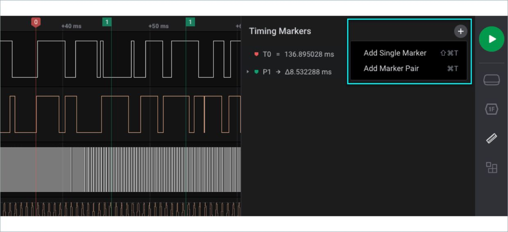
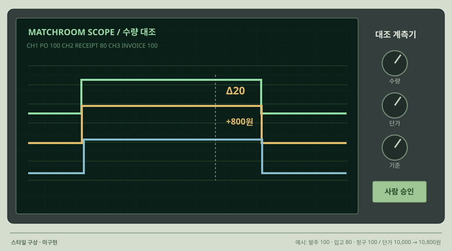

# 10 · 계측 장비처럼 보는 검증 트랙

## 실제 참고 화면

- 원작: Saleae Logic 2 · Timing Markers
- [원본 출처](https://www.saleae.com/support/logic-software/viewing-and-analyzing-data/measurements-timing-markers)
- 이미지 유형: browser_render_screenshot · 2026-10-09 보존.
- 분류: 시간
- 화면 설명: 공식 도움말의 타이밍 마커와 신호 트랙 화면. 어두운 바탕에 여러 채널과 선택 구간을 분리하는 계측 도구의 시각 문법.
- 시각 원리: 다중 채널과 구간 마커
- 어울리는 업무: 이벤트 대조·검증 기록·오류 시점
- 재사용 기준: 기록되지 않은 파형을 꾸미지 않기
- 원본 확인 기록: Saleae 공식 도움말과 직접 연결된 원본 PNG를 확인. 기술 계측 인터페이스의 스타일 참고.

## 프로젝트 적용 시안 — 미구현

- 적용 방향: 문서 필드별 검증 결과와 실행 이벤트를 트랙으로 나눠 어떤 조건에서 불일치가 생겼는지 보여줍니다.
- 조작 아이디어: 트랙과 구간을 선택해 관련 문서·기준값·실행 기록을 열고 전후 차이를 겹쳐 봅니다.
- 선택 시 고려할 점: 업무 데이터를 실제 전기 파형처럼 꾸미지 않습니다. 기록한 이벤트와 판정 상태에만 트랙을 연결합니다.

이 SVG는 합성 업무 예시를 비교하기 위한 구성 시안입니다. 실제 조작·계산이 가능한 구현 화면으로 인용하지 않습니다. 현재 구현 상태는 [DECISIONS.md](../DECISIONS.md)를 확인하세요.
