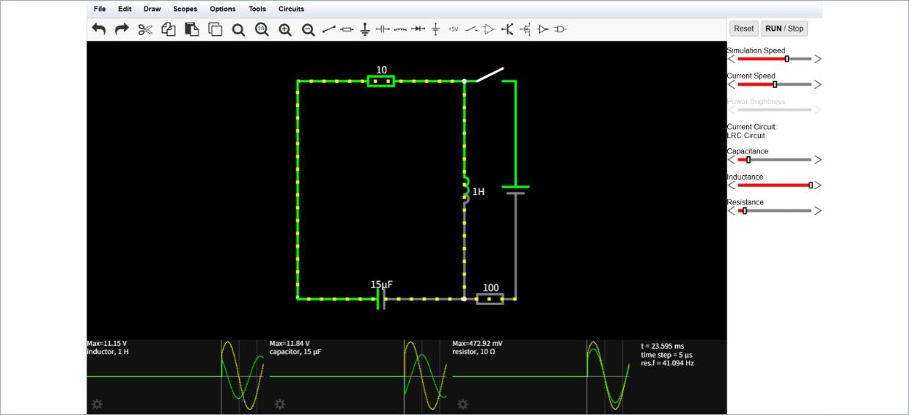
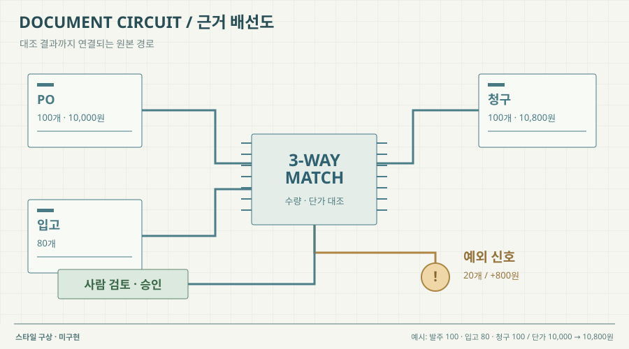

# 11 · 회로도처럼 잇는 검증 근거

## 실제 참고 화면

- 원작: Falstad CircuitJS · LRC 회로 시뮬레이터
- [원본 출처](https://www.falstad.com/circuit/)
- 이미지 유형: browser_render_screenshot · 2026-10-09 보존.
- 분류: 근거
- 화면 설명: 공식 회로 시뮬레이터에서 회로 기호·배선·물리량·조절값·파형을 함께 보여주는 실제 화면.
- 시각 원리: 기호·배선·변수 조절
- 어울리는 업무: 검증 근거의 의존 관계
- 재사용 기준: 회로 기호를 그대로 업무 용어로 치환하지 않기
- 원본 확인 기록: 2026-10-09 공식 페이지의 Full Screen version 링크로 들어가 실제 회로 화면을 열고 브라우저 캡처·재열람했습니다. 업무 은유의 참고이며 새 프로젝트 기능 검증이 아닙니다.

## 프로젝트 적용 시안 — 미구현

- 적용 방향: 원본 문서, 추출한 필드, 대조한 기준값을 회로 기호처럼 배치하고, 불일치가 생긴 필드에서 증빙 원본과 검증 결과로 선을 연결한다. 하단 파형 자리는 실제로 기록된 단계별 처리 이벤트를 표시하는 데 활용할 수 있다.
- 조작 아이디어: 문서 필드나 검증 규칙을 선택하면 관련 원문 위치와 계산 근거를 강조하고, 허용 오차를 바꾸면 해당 문서의 판정 상태를 다시 계산한다.
- 선택 시 고려할 점: 공학 기호와 파형은 정밀하고 신뢰감 있지만 회계 문서 검토와 비슷해 보이지 않을 수 있다. 금융 용어를 회로 기호로 억지 번역하지 말고 구조와 강조 방식만 참고한다.

이 SVG는 합성 업무 예시를 비교하기 위한 구성 시안입니다. 실제 조작·계산이 가능한 구현 화면으로 인용하지 않습니다. 현재 구현 상태는 [DECISIONS.md](../DECISIONS.md)를 확인하세요.
