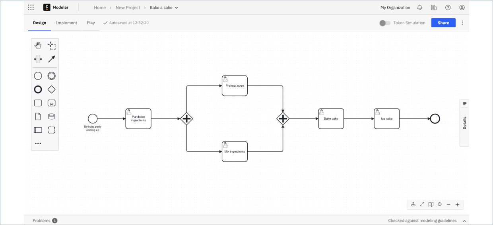
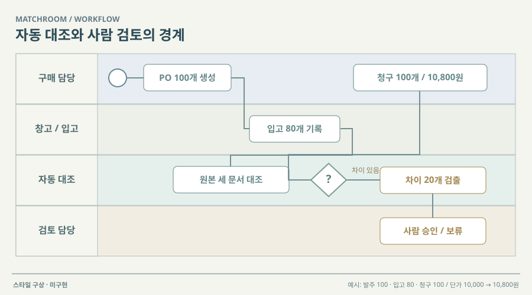

# 12 · 분기·병렬 처리를 보는 업무 모식도

## 실제 참고 화면

- 원작: Camunda Web Modeler — Bake a Cake BPMN
- [원본 출처](https://docs.camunda.io/docs/components/modeler/bpmn/automating-a-process-using-bpmn/)
- 이미지 유형: 원격 미디어 파일 다운로드가 아닌 브라우저 표시 영역 캡처. 2026-10-09 보존.
- 분류: 흐름
- 화면 설명: Camunda 공식 BPMN 튜토리얼의 넓은 작업 캔버스. 시작·작업·분기·병렬 처리를 표준 기호로 놓고, 좌측 도구 팔레트와 상단 모드 전환이 캔버스에 붙어 있다.
- 시각 원리: 레인·분기·병렬·작업 토큰
- 어울리는 업무: 사람/자동화 책임 경계
- 재사용 기준: 현재 실행 경로 우선·전체도 분리
- 원본 확인 기록: 1차 출처: Camunda 공식 8 문서의 BPMN 튜토리얼. 이미지 URL은 출처가 본문에서 제공한 공식 PNG이며 HEAD HTTP 200, image/png 확인. 업무 요구의 증거가 아닌 참고 UI.

## 프로젝트 적용 시안 — 미구현

- 적용 방향: 문서 접수, AI 추출·대조, 사람의 추가자료 요청, 승인·반려, 가상 원장 기록을 역할별 가로 레인으로 나눈다. 사람이 개입해야 하는 경계와 자동 진행을 한 화면에서 구분한다.
- 조작 아이디어: 시나리오 실행 중인 작업 토큰을 현재 단계에 표시한다. 검토자가 보완자료를 추가하거나 승인·반려하면 토큰이 다음 단계로 이동하고 해당 문서 상태가 바뀐다.
- 선택 시 고려할 점: 단계와 책임 경계를 설명하기 좋지만 분기와 예외가 늘면 도식이 빽빽해진다. 현재 문서 한 건의 실행 경로를 우선 강조하고 전체 정의도는 별도로 둔다.

이 SVG는 당시 동일한 합성 업무 예시를 비교하기 위한 구성 시안이다. 실제 조작·계산이 가능한 구현 화면으로 인용하지 않는다. 현재 구현 상태는 별도 `DECISIONS.md`와 `current-implementation/`을 확인한다.
