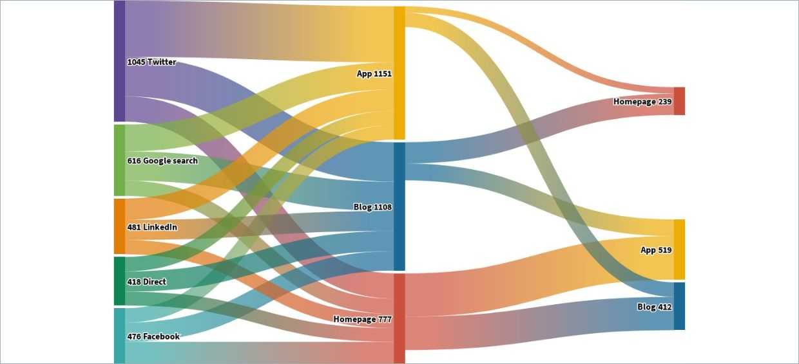
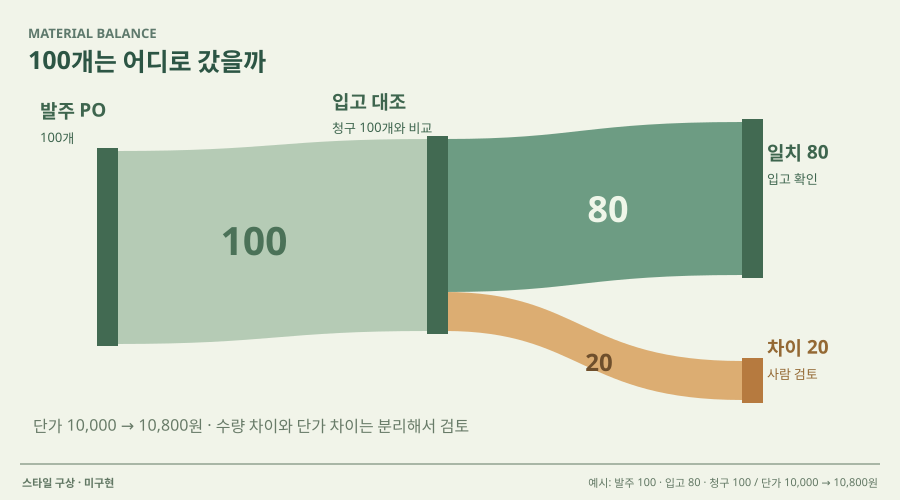

# 13 · 폭으로 읽는 문서 흐름

## 실제 참고 화면

- 원작: Flourish — Sankey animation example
- [원본 출처](https://public.flourish.studio/visualisation/487531/)
- 이미지 유형: 원격 미디어 파일 다운로드가 아닌 브라우저 표시 영역 캡처. 2026-10-09 보존.
- 분류: 흐름
- 화면 설명: Flourish 공개 Sankey 사례. 단계별 범주를 넓이가 달라지는 연결 띠로 이어 데이터가 어느 갈래로 얼마나 이동했는지 보여주는 흐름 중심 시각화다.
- 시각 원리: 분기별 건수를 연결 띠의 폭으로 표시
- 어울리는 업무: 처리 분포·누락·전환 비교
- 재사용 기준: 분모·단위·합성 여부 표시
- 원본 확인 기록: 1차 시각자료: Flourish가 호스팅하는 공개 Sankey 인터랙티브 사례. 페이지 HTTP 200, 썸네일 HEAD HTTP 200, image/jpeg 확인. 사례는 시각 형식 참고이며 회사 수요나 실제 성과 근거가 아니다.

## 프로젝트 적용 시안 — 미구현

- 적용 방향: 테스트 데이터에서 접수된 증빙 건수가 추출 성공, 불일치, 추가자료 요청, 승인, 보류로 어떻게 이동했는지 실제 건수로만 표현한다. 사용자가 흐름을 선택하면 해당 문서 목록을 연다.
- 조작 아이디어: 시나리오나 검증 기준을 바꾸면 전후 Sankey의 흐름 폭과 분기별 건수가 재계산된다. 각 흐름 클릭 시 표본 문서와 판정 이유를 보여준다.
- 선택 시 고려할 점: 전체 분포와 누락 구간을 직관적으로 보여주지만 소량 사례에서 흐름 폭 차이가 과장되어 보일 수 있다. 단위와 분모를 표시하고 합성 데이터는 데모값으로 명시해야 한다.

이 SVG는 당시 동일한 합성 업무 예시를 비교하기 위한 구성 시안이다. 실제 조작·계산이 가능한 구현 화면으로 인용하지 않는다. 현재 구현 상태는 별도 `DECISIONS.md`와 `current-implementation/`을 확인한다.
