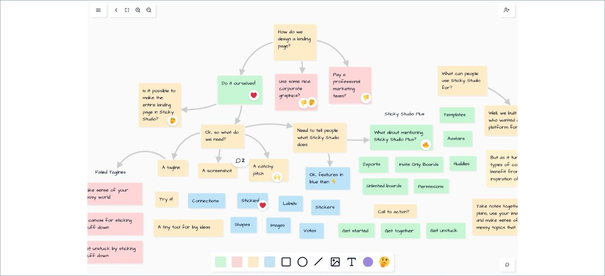
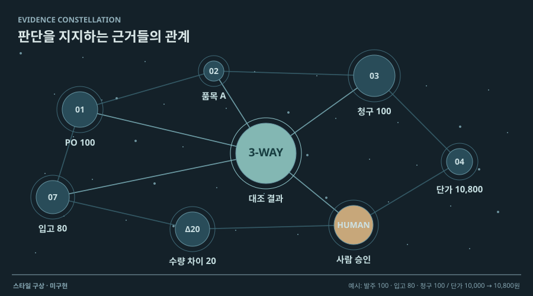

# 14 · 판정 근거를 잇는 관계 지도

## 실제 참고 화면

- 원작: Kumu — Systems Mapping canvas
- [원본 출처](https://www.kumu.io/)
- 이미지 유형: browser_render_screenshot · 2026-10-09 보존.
- 분류: 근거
- 화면 설명: Kumu 공식 제품 사이트의 시스템 맵 작업 화면. 여러 요소와 그 사이 관계를 자유 좌표에 배치하고 선으로 연결해 한 요소의 주변 맥락을 탐색하는 네트워크 지도 구조다.
- 시각 원리: 대상과 관계를 자유 좌표로 연결
- 어울리는 업무: 문서 계보·판정 원인·관계 탐색
- 재사용 기준: 관련 경로만 열어 선의 혼잡 줄이기
- 원본 확인 기록: 1차 출처: Kumu 공식 제품 웹사이트. 이미지 URL은 공식 자산 도메인의 제품 스크린샷이며 HEAD HTTP 200, image/jpeg 확인. 관계 맵 형식 참고용이다.

## 프로젝트 적용 시안 — 미구현

- 적용 방향: 원본 영수증·송장, 추출된 날짜·금액·거래처, 적용 기준, 불일치 이유를 노드로 두고 실제 검토 근거를 선으로 잇는다. 연결된 자료만 강조해 판정이 어떤 근거에서 나왔는지 추적한다.
- 조작 아이디어: 불일치 노드를 선택하면 연결된 원본 영역과 규칙, 추가자료 요청, 승인 기록을 하이라이트한다. 필터로 문서·필드·담당자 유형을 좁힌다.
- 선택 시 고려할 점: 증빙 계보를 넓게 볼 수 있지만 모든 필드를 연결하면 선이 엉켜 읽기 어렵다. 한 판정과 관련된 경로만 단계별로 열고 관계 유형을 최소화한다.

이 SVG는 합성 업무 예시를 비교하기 위한 구성 시안입니다. 실제 조작·계산이 가능한 구현 화면으로 인용하지 않습니다. 현재 구현 상태는 [DECISIONS.md](../DECISIONS.md)를 확인하세요.
