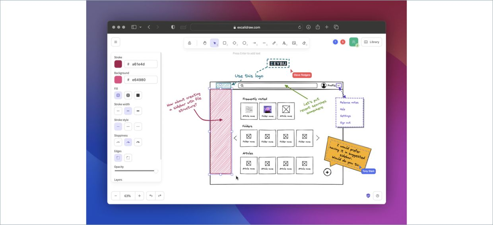
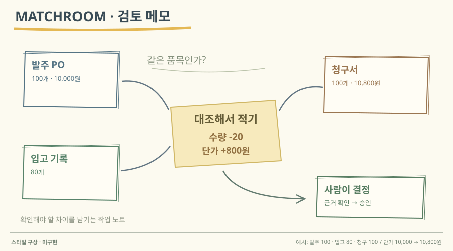

# 16 · 기술 화이트보드와 주석

## 실제 참고 화면

- 원작: Excalidraw — GitHub README product showcase
- [원본 출처](https://github.com/excalidraw/excalidraw/blob/master/README.md)
- 이미지 유형: 원격 미디어 파일 다운로드가 아닌 브라우저 표시 영역 캡처. 2026-10-09 보존.
- 분류: 설명
- 화면 설명: Excalidraw 공식 README의 Product showcase 이미지. 브라우저 안 실제 화이트보드 편집 화면에 손그림 스타일의 웹페이지 와이어프레임, 주석 화살표, 선택 영역, 색상·선 스타일 패널, 협업 사용자 표시가 함께 보인다.
- 시각 원리: 화이트보드·주석·자유 배치
- 어울리는 업무: 문제 정의·설계 설명·협업
- 재사용 기준: 손그림 표현과 실제 제품 기능을 구분
- 원본 확인 기록: 1차 출처: Excalidraw 공식 GitHub README가 Product showcase로 직접 삽입한 이미지. 브라우저에서 원본 이미지를 열어 실제 편집기와 와이어프레임·주석·도구 패널을 육안 확인했다. 로고 OG 배너가 아니다.

## 프로젝트 적용 시안 — 미구현

- 적용 방향: 원본 문서, 추출 필드, 검토 메모, 불일치 연결을 자유 배치하되 각 주석이 어떤 근거를 가리키는지 선과 라벨로 표시한다. 고정된 단계 흐름보다 여러 증거 간 관계를 설명하는 장면에 쓴다.
- 조작 아이디어: 카드나 주석을 끌어 위치를 바꾸고, 화살표를 연결하거나 색을 바꿔 근거 관계를 직접 구성한다. 특정 필드 주석을 선택하면 원문 인용과 검토 메모를 연다.
- 선택 시 고려할 점: 관계를 빠르게 스케치하고 협업 설명을 붙이기 좋지만 정렬·규칙 일관성은 사용자가 관리해야 한다. 감사 가능한 정형 단계 표현이나 자동 처리 순서의 유일한 근거로 쓰지는 않는다.

이 SVG는 당시 동일한 합성 업무 예시를 비교하기 위한 구성 시안이다. 실제 조작·계산이 가능한 구현 화면으로 인용하지 않는다. 현재 구현 상태는 별도 `DECISIONS.md`와 `current-implementation/`을 확인한다.
