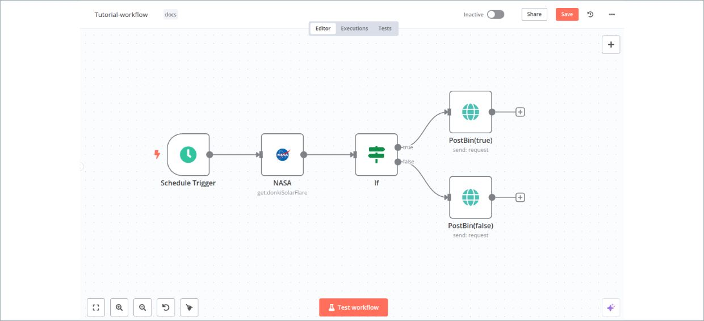
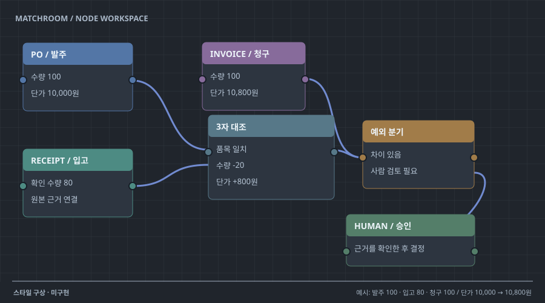

# 17 · 도구 실행을 펼치는 노드 캔버스

## 실제 참고 화면

- 원작: n8n — Build your first workflow editor screenshot
- [원본 출처](https://github.com/n8n-io/n8n-docs/blob/main/docs/get-started/build-your-first-workflow.md)
- 이미지 유형: browser_render_screenshot · 2026-10-09 보존.
- 분류: 흐름
- 화면 설명: n8n 공식 문서의 실제 워크플로 편집기 캡처. 상단 Editor·Executions 탭과 하단 Test workflow 버튼, 중앙 Schedule Trigger → NASA → If 노드 및 true/false 경로의 PostBin 요청 노드 두 개가 보인다. 여러 연결 노드와 분기 구조가 채워진 편집 캔버스다.
- 시각 원리: 도구 노드와 실행 경로
- 어울리는 업무: Agent·자동화·도구 입출력
- 재사용 기준: 노드 수보다 결과와 오류 원인 강조
- 원본 확인 기록: 1차 출처: n8n 공식 첫 워크플로 문서가 사용하는 이미지 자산. 문서 원본 Markdown과 저장소의 자산 경로를 확인하고 브라우저에서 이미지를 직접 열어 다중 노드 편집 UI를 육안 확인했다. 실제 실행 완료/결과 오버레이 캡처는 아니다.

## 프로젝트 적용 시안 — 미구현

- 적용 방향: 문서 입력, 필드 추출, 규칙 대조, 사람 검토, 가상 원장 기록을 단계별 노드로 보여준다. 선택한 단계의 입력·출력을 확인해 자동 처리와 사람 판단의 경계를 설명한다.
- 조작 아이디어: 노드를 선택해 단계별 입출력 데이터를 열고, 테스트 입력이나 분기 기준을 바꿔 어느 경로로 진행되는지 확인한다. 실패한 단계만 재실행하고 뒤 단계의 결과 차이를 비교한다.
- 선택 시 고려할 점: 분기와 단계 순서를 제품 편집기 안에서 빠르게 읽을 수 있지만 노드가 늘수록 배선도가 복잡해진다. 이 공식 캡처는 다중 노드 편집 화면이며 완료된 실행의 노드별 결과 오버레이는 보여주지 않는다. 실행 결과 스타일의 근거로 확대 해석하지 않는다.

이 SVG는 합성 업무 예시를 비교하기 위한 구성 시안입니다. 실제 조작·계산이 가능한 구현 화면으로 인용하지 않습니다. 현재 구현 상태는 [DECISIONS.md](../DECISIONS.md)를 확인하세요.
