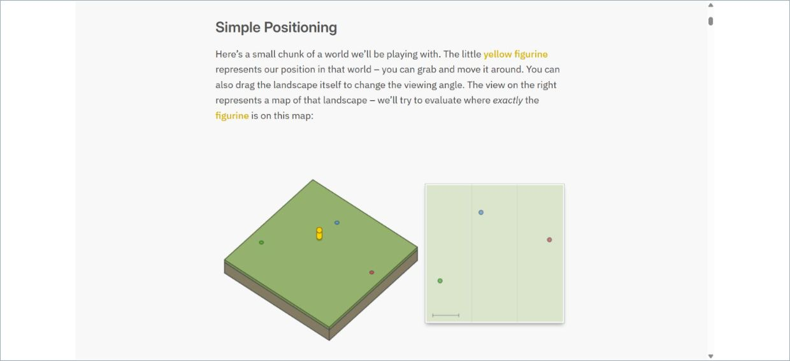
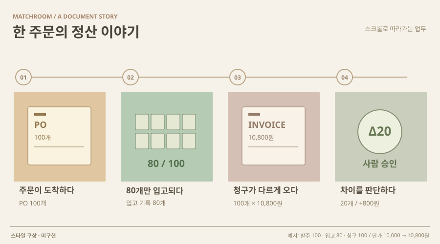

# 18 · 모식도를 조작하며 따라가는 설명

## 실제 참고 화면

- 원작: Bartosz Ciechanowski · GPS
- [원본 출처](https://ciechanow.ski/gps/)
- 이미지 유형: 원격 미디어 파일 다운로드가 아닌 브라우저 표시 영역 캡처. 2026-10-09 보존.
- 분류: 설명
- 화면 설명: 저자가 직접 만든 인터랙티브 설명. 짧은 본문 아래 3D 공간과 2D 모식도가 연결되고, 장면을 따라 원리를 단계적으로 설명합니다.
- 시각 원리: 조작하는 모식도와 짧은 설명
- 어울리는 업무: 메커니즘·입력과 결과의 인과관계
- 재사용 기준: 설명과 실제 모델의 한계를 함께 제시
- 원본 확인 기록: 저자 공식 사이트의 GPS 설명을 직접 열어 Simple Positioning 구역의 3D·2D 연결 화면을 브라우저에서 캡처·육안 확인했습니다. 과학 설명 문법을 참고하며 GPS 기술을 새 앱 기능으로 주장하지 않습니다.

## 프로젝트 적용 시안 — 미구현

- 적용 방향: 문서가 어떤 값으로 읽히고 어떤 근거에서 판정이 달라지는지 조작 가능한 짧은 장면으로 설명합니다.
- 조작 아이디어: 한 단계씩 진행하면서 대상 필드와 원본 영역을 강조하고, 조건을 바꿔 전후 결과를 같은 장면에서 비교합니다.
- 선택 시 고려할 점: 업무를 배우거나 포트폴리오를 설명할 때 유용하지만 대량 처리에는 별도의 검토 목록이 필요합니다.

이 SVG는 당시 동일한 합성 업무 예시를 비교하기 위한 구성 시안이다. 실제 조작·계산이 가능한 구현 화면으로 인용하지 않는다. 현재 구현 상태는 별도 `DECISIONS.md`와 `current-implementation/`을 확인한다.
