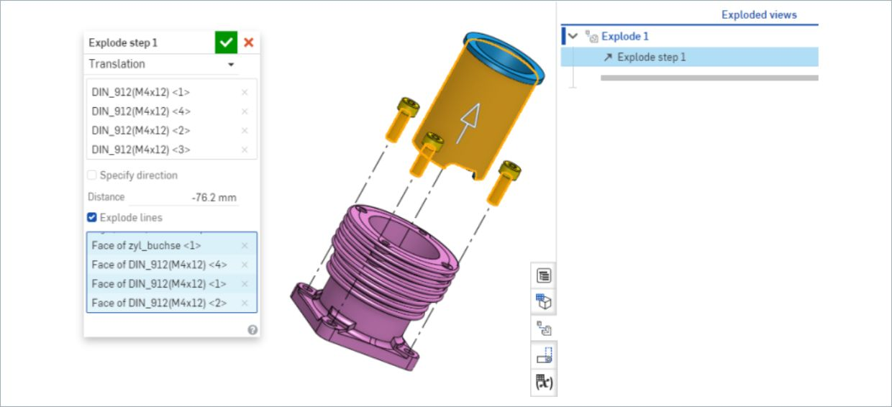
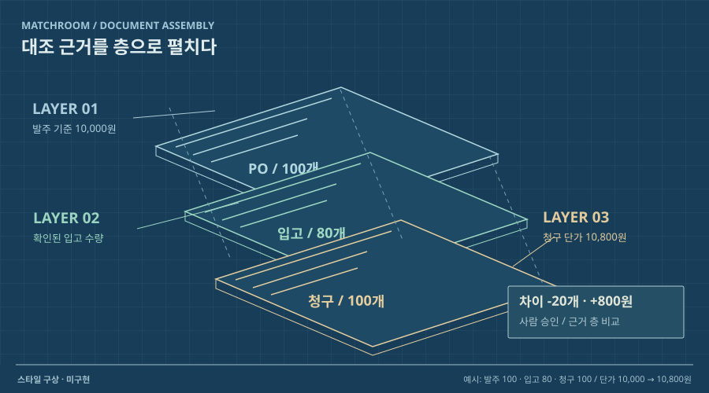

# 19 · 근거 층을 펼치는 기술 분해도

## 실제 참고 화면

- 원작: Onshape — Exploded Views
- [원본 출처](https://cad.onshape.com/help/Content/Assembly/exploded_views.htm)
- 이미지 유형: 원격 미디어 파일 다운로드가 아닌 브라우저 표시 영역 캡처. 2026-10-09 보존.
- 분류: 근거
- 화면 설명: Onshape 공식 도움말의 분해 조립 편집기 스크린샷. 3D 조립품에서 부품을 떨어뜨려 배치하고, 분해선과 편집 중 상태를 패널에서 함께 보여주는 기술 설계도형 화면이다.
- 시각 원리: 구성 요소를 떨어뜨린 분해도
- 어울리는 업무: 원문·추출·규칙·판정의 책임 분리
- 재사용 기준: 깊이감은 근거 계층을 설명할 때만
- 원본 확인 기록: 1차 출처: Onshape 공식 Exploded Views 도움말. 직접 연결된 이미지 HEAD HTTP 200, image/png 확인. 공식 제품의 실제 편집 화면이며 다른 회사의 요구나 구현 완료를 입증하지 않는다.

## 프로젝트 적용 시안 — 미구현

- 적용 방향: 송장이나 영수증을 층별 문서처럼 시각화할 때 원본 페이지, 추출 필드, 정규화값, 판정 사유를 서로 분리해 근거가 쌓이는 순서를 보여준다. 실제 문서 처리 순서를 기준으로 층을 펼친다.
- 조작 아이디어: 층을 한 단계씩 펼치거나 되감으면 해당 단계에서 추가된 값과 근거만 드러난다. 원본의 특정 필드 층을 선택해 추출·대조·사람 수정 이력을 비교한다.
- 선택 시 고려할 점: 구성 요소의 관계와 분리 과정을 강하게 보여주지만, 평면 문서에 3D를 그대로 쓰면 장식처럼 느껴질 수 있다. 깊이감은 실제 근거 계층이 설명을 돕는 경우에만 적용한다.

이 SVG는 당시 동일한 합성 업무 예시를 비교하기 위한 구성 시안이다. 실제 조작·계산이 가능한 구현 화면으로 인용하지 않는다. 현재 구현 상태는 별도 `DECISIONS.md`와 `current-implementation/`을 확인한다.
