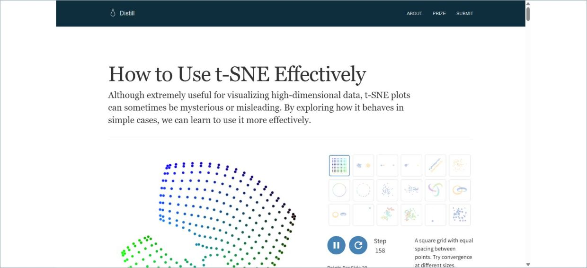
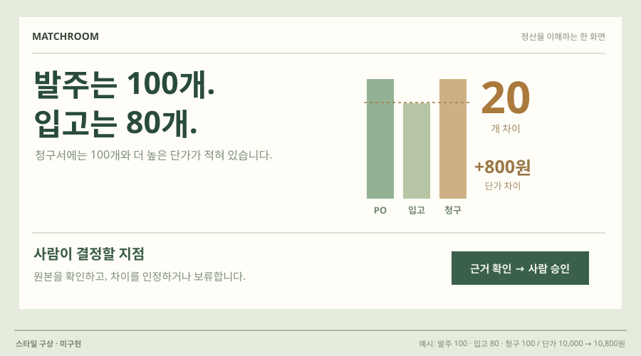

# 20 · 설명과 조작이 붙은 실험 노트

## 실제 참고 화면

- 원작: Distill — How to Use t-SNE Effectively
- [원본 출처](https://distill.pub/2016/misread-tsne/)
- 이미지 유형: 원격 미디어 파일 다운로드가 아닌 브라우저 표시 영역 캡처. 2026-10-09 보존.
- 분류: 설명
- 화면 설명: Distill의 연구 설명 글은 본문과 인터랙티브 그림을 엮어 독자가 입력값을 바꾸며 결과 변화와 해석의 한계를 직접 확인하게 한다. 하나의 완성 대시보드보다 설명과 조작이 번갈아 이어지는 구성이다.
- 시각 원리: 본문과 인터랙티브 실험
- 어울리는 업무: 사용자 학습·파라미터 민감도
- 재사용 기준: 운영 화면보다 튜토리얼·실험에 적합
- 원본 확인 기록: Distill 저자 제작 인터랙티브 설명을 브라우저에서 직접 확인·캡처했습니다. 합성 예시 조작과 본문이 결합된 형식을 참고하며 회사 수요 근거가 아닙니다.

## 프로젝트 적용 시안 — 미구현

- 적용 방향: 거래일 허용 범위, 금액 차이 기준 같은 검증 조건을 직접 바꾸고 문서별 일치·불일치 결과가 어떻게 달라지는지 설명과 함께 탐색한다. 바뀐 판정과 근거를 나란히 보여준다.
- 조작 아이디어: 사용자가 기준 슬라이더를 움직이면 대상 문서의 비교 결과가 즉시 갱신되고, 결과의 의미와 한계가 옆 설명에서 바뀐다. 원래 기준과 수정 기준의 판정을 함께 보존한다.
- 선택 시 고려할 점: 조건과 결과의 관계를 학습시키는 데 강하지만 여러 문서를 동시에 운영하는 업무 화면으로는 느리고 서사적이다. 튜토리얼·실험 모드에 적합하다.

이 SVG는 당시 동일한 합성 업무 예시를 비교하기 위한 구성 시안이다. 실제 조작·계산이 가능한 구현 화면으로 인용하지 않는다. 현재 구현 상태는 별도 `DECISIONS.md`와 `current-implementation/`을 확인한다.
