# 추가 12개 UI 방법 · 큰 사진과 해설

[README로 돌아가기](../README.md) · [32개 전체 설명](../CATALOG.md) · [갤러리 사용 순서](GALLERY_SCREENSHOTS.md)

기존 20개와 다른 정보 구조·조작 방법을 추가한 21–32번입니다. 각 사진은 저장소에 포함돼 있어 GitHub에서도 바로 읽을 수 있습니다. 사진을 누르면 개별 PNG가 열립니다. 참고 이미지와 자체 시안은 같은 번호로 연결됩니다.

**읽는 순서:** 원본 사진 → 표현 원리 → 적합 업무 → 기존 후보와의 차이 → 직접 확인한 조작 → 자체 시안과 한계.

**자료 구분:** 28번은 공식 자료에 남은 역사적 연구 개념도입니다. 다른 11개는 핵심 조작을 브라우저에서 확인했으나 제품 전체 기능·정확성·성능을 검증한 것은 아닙니다. 자체 SVG는 모두 정적인 미구현 시안이며 합성 업무 예시를 사용합니다.

## 번호별 바로 가기

- [21 · 면적에서 시작하는 계층 확대](#style-21)
- [22 · 조건을 동시에 좁히는 다축 비교](#style-22)
- [23 · 가정을 검사하는 인과 모델](#style-23)
- [24 · 입력·코드·결과가 이어지는 계산 노트](#style-24)
- [25 · 결과를 만져 원본을 바꾸는 편집기](#style-25)
- [26 · 명령으로 들어가는 중첩 탐색](#style-26)
- [27 · 스크롤이 장면을 진행하는 공간 서사](#style-27)
- [28 · 같은 위치에서 의미 층을 넘기는 렌즈](#style-28)
- [29 · 확대할수록 사건이 열리는 시간 지도](#style-29)
- [30 · 문서를 자유롭게 놓는 비교 작업 공간](#style-30)
- [31 · 측정 점을 분류하며 보는 기술 장면](#style-31)
- [32 · 한 번에 두 기준만 판단하는 의사결정](#style-32)

## 21 · 면적에서 시작하는 계층 확대

**참고작:** [D3 · Zoomable treemap](https://observablehq.com/@d3/zoomable-treemap) · [상세 후보 문서](../candidates/21.md)

[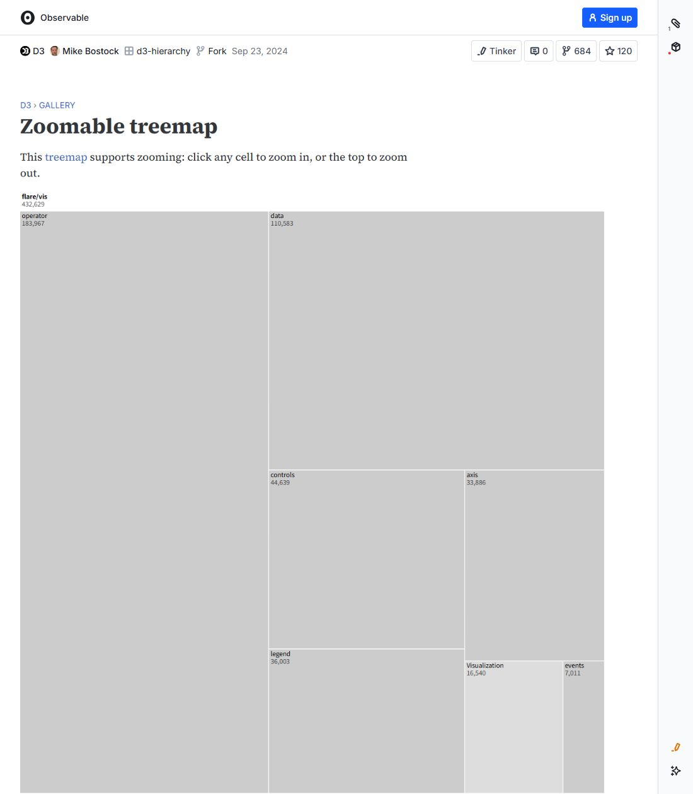](../images/21-reference.png)

**화면에서 볼 부분:** 큰 사각형 안에 하위 집단을 면적으로 배치하고, 선택한 집단으로 화면 전체를 확대합니다. 상단 경로가 현재 계층을 알려줍니다.

**표현 원리:** 집단의 크기와 포함 관계를 동시에 읽는 계층 탐색

**어울리는 업무:** 업무 묶음·비용 구성·오류 유형의 드릴다운

**기존 후보와의 차이:** 13 Sankey는 이동량, 14 관계 지도는 연결을 보여줍니다. 21은 부모·자식 포함 관계와 집단 크기를 확대하며 탐색합니다.

**직접 확인한 조작과 한계:** vis를 클릭해 operator·data·controls 등 하위 집단으로 바뀌는 것을 확인했습니다.

같은 번호의 자체 적용 시안 보기 · 미구현

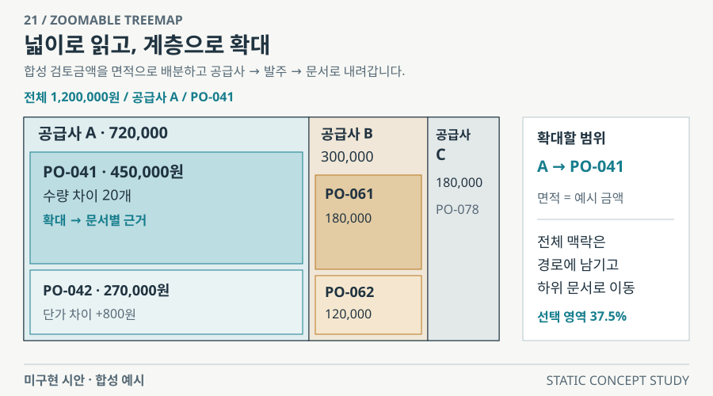

**적용 구상:** 합성 검토금액을 공급사와 발주별 면적으로 나눕니다. Matchroom 문서 묶음에서 큰 검토 대상을 먼저 찾는 구상입니다.

**선택 시 주의점:** 작은 면적의 라벨은 읽기 어렵습니다. 면적이 작은 항목을 찾을 검색·목록 보조가 필요합니다.

## 22 · 조건을 동시에 좁히는 다축 비교

**참고작:** [Vega · Interactive Parallel Coordinates](https://vega.github.io/vega/examples/parallel-coordinates-interactive/) · [상세 후보 문서](../candidates/22.md)

[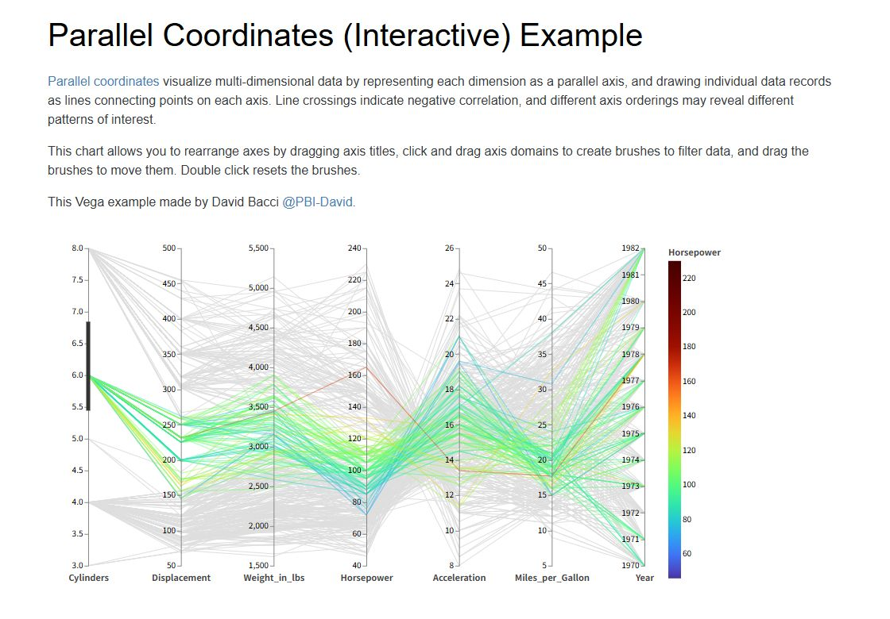](../images/22-reference.png)

**화면에서 볼 부분:** 차량 한 대가 여러 세로 축을 잇는 선으로 나타납니다. 한 축에서 범위를 선택하면 조건에 맞는 선이 강조되고 다른 선은 흐려집니다.

**표현 원리:** 여러 속성을 한 화면에서 범위 선택으로 비교

**어울리는 업무:** 대안 탐색·운영 조건 비교·다변량 이상치

**기존 후보와의 차이:** 10의 신호 트랙은 시간 변화입니다. 22의 축은 비용·품질·지연 같은 서로 다른 속성이며 한 선은 하나의 대안입니다.

**직접 확인한 조작과 한계:** Cylinders 축에서 범위를 드래그해 강조 대상이 바뀌는 것을 확인했습니다. 축 재배열·더블클릭 초기화는 공식 안내에서 확인했습니다.

같은 번호의 자체 적용 시안 보기 · 미구현

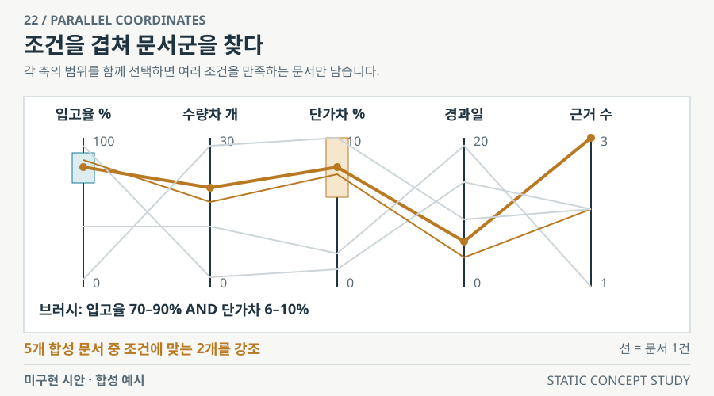

**적용 구상:** 입고율·수량차·단가차·경과일·근거 수를 나란한 축으로 펼쳐 예외 문서를 비교하는 구상입니다.

**선택 시 주의점:** 데이터가 많으면 선이 겹칩니다. 대표 표본·투명도·선택 집계가 필요하며 인과관계를 입증하지 않습니다.

## 23 · 가정을 검사하는 인과 모델

**참고작:** [DAGitty v3.1](https://www.dagitty.net/dags.html) · [상세 후보 문서](../candidates/23.md)

[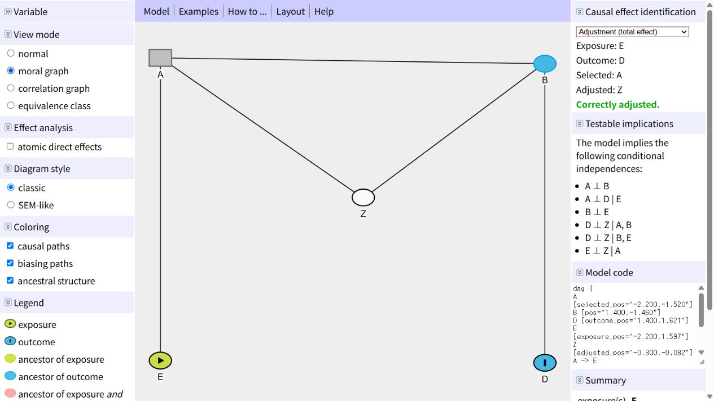](../images/23-reference.png)

**화면에서 볼 부분:** 변수 역할·경로 색·분석 모드와 효과 식별 결과를 그래프 주변에 배치합니다. 오른쪽 모델 코드가 그림과 함께 보입니다.

**표현 원리:** 연결의 의미와 분석 가정을 드러내는 모델 작업 공간

**어울리는 업무:** 실험 설계·원인 가설·편향 검토

**기존 후보와의 차이:** 14의 일반 관계 지도와 달리 exposure·outcome·adjusted 역할과 분석 전제가 핵심입니다. 업무 증빙 연결과 인과 추론을 혼동하지 않습니다.

**직접 확인한 조작과 한계:** normal에서 moral graph로 전환해 선택 모드와 그래프 표현이 달라지는 것을 확인했습니다. 효과 식별 전체 정확성을 별도 검증한 것은 아닙니다.

같은 번호의 자체 적용 시안 보기 · 미구현

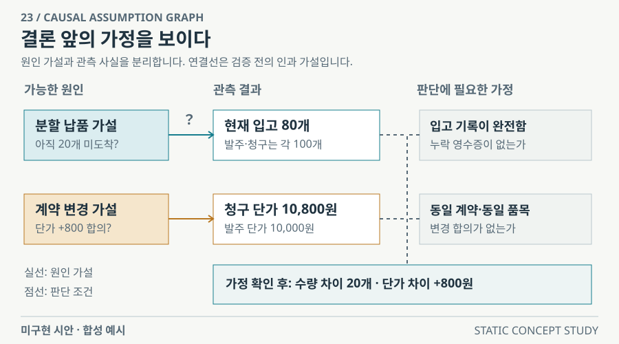

**적용 구상:** 분할 납품과 계약 변경이라는 원인 가설을 입고 수량·단가 관측에 연결합니다. 결론을 성립시키는 기록 완전성과 품목 일치 가정을 옆에 둡니다.

**선택 시 주의점:** 가정이 틀리면 분석도 틀릴 수 있습니다. 통계 지식 없이 자동 원인 판정 UI로 만들면 오해가 큽니다.

## 24 · 입력·코드·결과가 이어지는 계산 노트

**참고작:** [Observable Notebooks 2.0 · System guide](https://observablehq.github.io/notebook-kit/system-guide) · [상세 후보 문서](../candidates/24.md)

[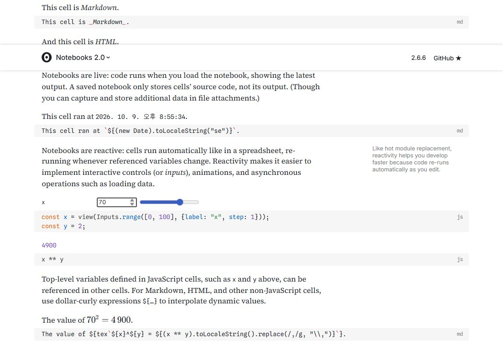](../images/24-reference.png)

**화면에서 볼 부분:** 설명 다음에 입력 슬라이더, 해당 입력의 코드, 계산 결과 셀이 이어집니다. 입력을 바꾸면 참조하는 결과 셀이 다시 계산됩니다.

**표현 원리:** 계산 과정과 결과를 함께 공개하는 반응형 셀

**어울리는 업무:** 업무 규칙 검토·재현 가능한 실험·분석 설명

**기존 후보와의 차이:** 20은 서사와 조작 설명을 결합합니다. 24는 셀 간 변수 의존과 재계산을 드러내므로 계산의 재현·검토에 더 적합합니다.

**직접 확인한 조작과 한계:** x 입력을 50에서70으로 바꾸자 x² 결과가2500에서4900으로 바뀌었습니다. 가이드 아래 일부 별도 라이브러리 예제 오류도 있어 전체 노트북 정상 동작을 주장하지 않습니다.

같은 번호의 자체 적용 시안 보기 · 미구현

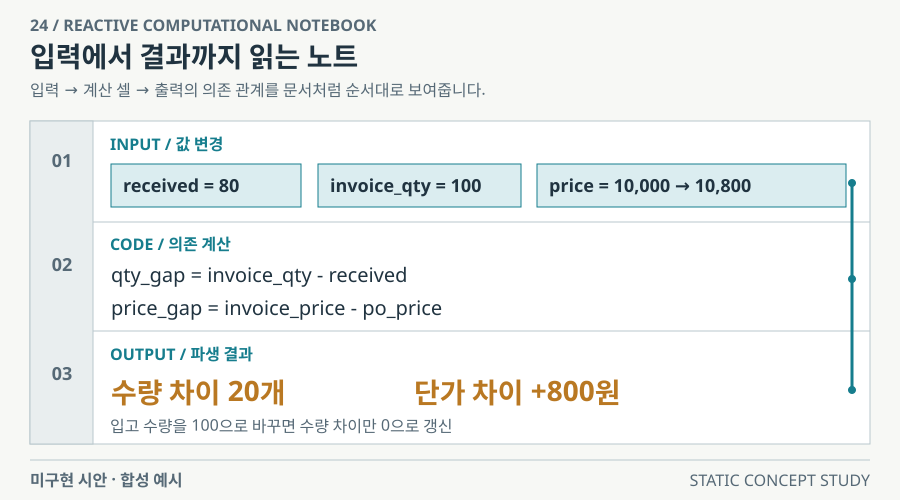

**적용 구상:** 발주·입고·청구 비교식을 입력 셀, 코드 셀, 결과 셀로 분리합니다. 계산이 어떤 값에 의존하는지 검토하는 구상입니다.

**선택 시 주의점:** 코드가 중심이 되면 일반 사용자에게 복잡합니다. 핵심 입력과 결과만 먼저 보여주는 접기 구조가 필요합니다.

## 25 · 결과를 만져 원본을 바꾸는 편집기

**참고작:** [Sketch-n-Sketch · UIST 2019 archive](https://ravichugh.github.io/sketch-n-sketch/releases/uist-2019-acm-archive/) · [상세 후보 문서](../candidates/25.md)

[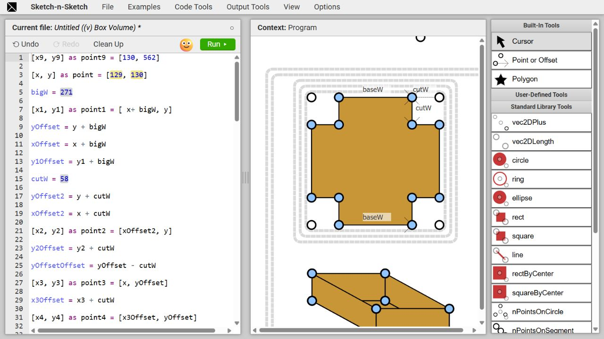](../images/25-reference.png)

**화면에서 볼 부분:** 왼쪽 코드, 가운데 SVG 결과와 조작 핸들, 오른쪽 도구가 연결됩니다. 결과의 점을 움직이면 코드의 좌표 상수가 함께 바뀝니다.

**표현 원리:** 결과 직접 조작과 원본 표현의 양방향 연결

**어울리는 업무:** 배치·시각 규칙 편집·설정 초안 생성

**기존 후보와의 차이:** 16 화이트보드는 그림을 작성하고17 노드 캔버스는 흐름을 연결합니다. 25는 출력 조작을 원본 코드 변경으로 되돌리는 방식입니다.

**직접 확인한 조작과 한계:** Box Volume 예시를 로드하고 핸들을 끌자 point 좌표가[102,109]에서[129,130]으로 바뀌었습니다. 합성 후보 추천의 완료·정확도는 검증하지 않았습니다.

같은 번호의 자체 적용 시안 보기 · 미구현

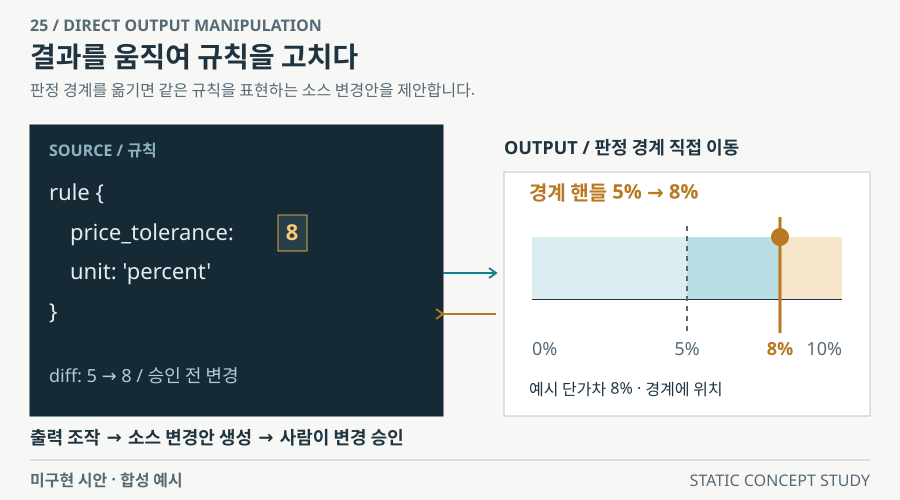

**적용 구상:** 단가 허용오차의 출력 경계를 직접 움직여 코드의 price_tolerance 변경안을 만드는 구상입니다. 규칙과 시각 결과를 함께 확인합니다.

**선택 시 주의점:** 2019 연구 아카이브입니다. 최신 제품 수준의 호환성·속도·안정성이 보장되지 않으며 업무 규칙 변경에는 승인·되돌리기가 필요합니다.

## 26 · 명령으로 들어가는 중첩 탐색

**참고작:** [Cmd+kit · Command palette demo](https://cmd-kit.vercel.app/) · [상세 후보 문서](../candidates/26.md)

[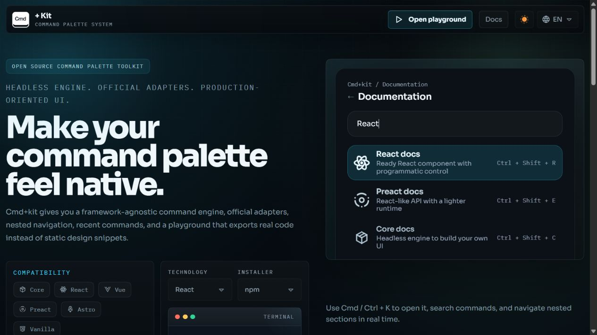](../images/26-reference.png)

**화면에서 볼 부분:** 검색창 아래 동작과 단축키가 목록으로 나타납니다. Documentation을 고르면 경로가 바뀌고 하위 명령이 보입니다.

**표현 원리:** 페이지 위치보다 수행할 동작을 먼저 찾는 탐색

**어울리는 업무:** 숙련 사용자 도구·다수 명령·빠른 대상 접근

**기존 후보와의 차이:** 기존20개에는 실행 구조·내용 시각화가 많습니다. 26은 행동을 검색해 진입하는 별도 탐색 방식으로 주 화면을 보조합니다.

**직접 확인한 조작과 한계:** Documentation 하위 명령을 열고 React를 입력해 검색 결과 순서가 바뀌는 것을 확인했습니다. 실제 명령의 외부 실행은 하지 않았습니다.

같은 번호의 자체 적용 시안 보기 · 미구현

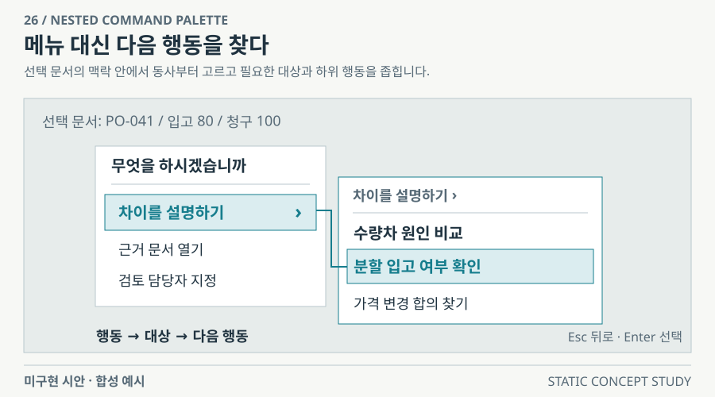

**적용 구상:** 문서 검토 중 ‘차이를 설명하기’ 같은 행동부터 선택한 뒤 분할 입고 확인이나 가격 변경 근거 찾기로 들어가는 구상입니다.

**선택 시 주의점:** 검색할 명칭을 모르면 막힙니다. 초보 사용자 온보딩이나 공간·흐름을 설명하는 첫 화면의 대체재로는 약합니다.

## 27 · 스크롤이 장면을 진행하는 공간 서사

**참고작:** [SBS · The Boat](https://www.sbs.com.au/theboat/) · [상세 후보 문서](../candidates/27.md)

[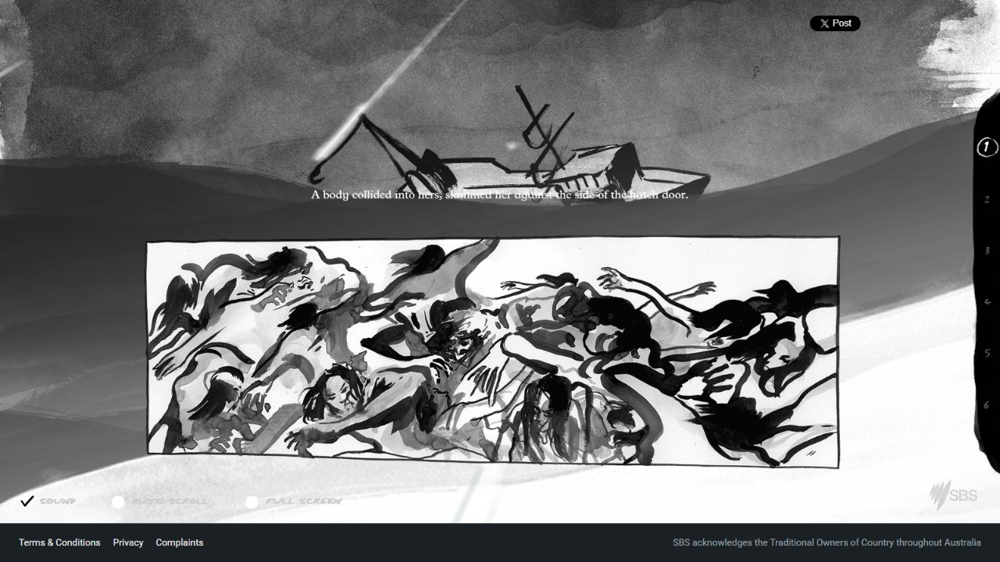](../images/27-reference.png)

**화면에서 볼 부분:** 시작 뒤 스크롤 위치에 따라 배·인물·문장과 비 장면이 진행됩니다. 장 번호·소리·자동 스크롤 조작은 화면 가장자리에 있습니다.

**표현 원리:** 읽기 진행과 장면 상태를 같은 흐름으로 묶는 스크롤 서사

**어울리는 업무:** 포트폴리오 설명·문제 발생 재현·짧은 온보딩

**기존 후보와의 차이:** 20의 글 속 독립 조작과 달리 스크롤 진행 자체가 무대의 장면 상태를 바꿉니다. 지속 운영 화면보다 설명·발표에 적합합니다.

**직접 확인한 조작과 한계:** Click to start 후 스크롤해 Chapter1과 본문 장면으로 이동하는 것을 확인했습니다. 제작사의 WebGL 설명은 문서 근거이며 내부 구현을 검사하지 않았습니다.

같은 번호의 자체 적용 시안 보기 · 미구현

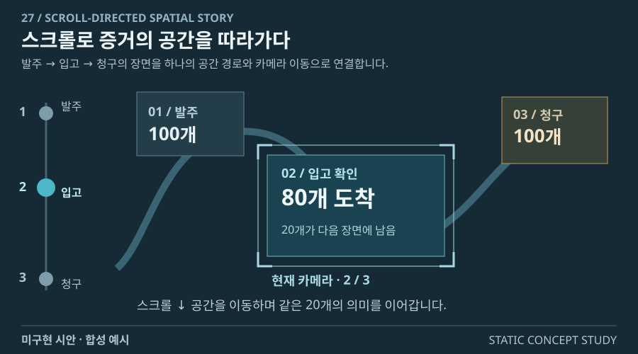

**적용 구상:** 발주 100개, 입고 80개, 청구 100개를 공간의 세 장면으로 두고 수량 차이 20개를 이어서 읽는 구상입니다.

**선택 시 주의점:** 장면 제작 비용이 높고 빠른 검색·반복 조작에는 불리합니다. 효과가 업무 설명보다 앞서면 내용이 가려집니다.

## 28 · 같은 위치에서 의미 층을 넘기는 렌즈

**참고작:** [Visual Engineers · dSense BIM layer navigation](https://visual-engineers.org/reflex/knowledge/case-studies/bim.html) · [상세 후보 문서](../candidates/28.md)

[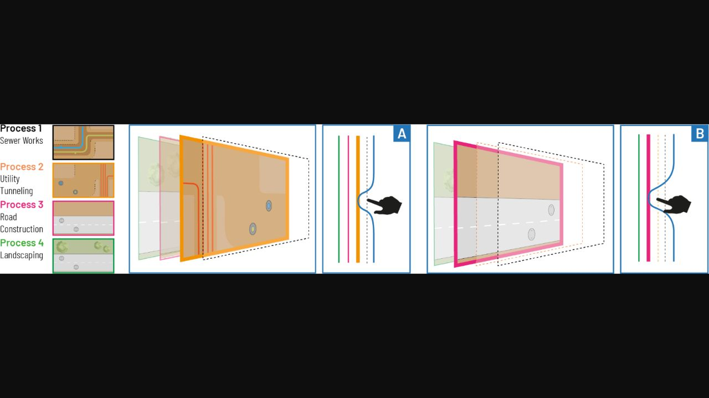](../images/28-reference.png)

**화면에서 볼 부분:** 도로·터널·조경 등 같은 위치의 공정 정보를 겹친 층으로 두고 관심 층을 앞으로 가져오는 개념도입니다.

**표현 원리:** 공간 맥락을 유지하며 정보 의미를 바꾸는 층 탐색

**어울리는 업무:** 지도·설계 검토·공정별 관찰·복합 근거 검사

**기존 후보와의 차이:** 19는 부품·근거를 분해해 전체 구성을 드러냅니다. 28은 같은 위치와 맥락을 유지한 채 보고 있는 의미 층만 전환합니다.

**직접 확인한 조작과 한계:** 공식 사례 문서와 LayerNavigation 원본 개념도를 확인했습니다. 2020년 Windows/WPF 연구 프로토타입이며 현재 브라우저에서 조작한 화면이 아닙니다.

같은 번호의 자체 적용 시안 보기 · 미구현

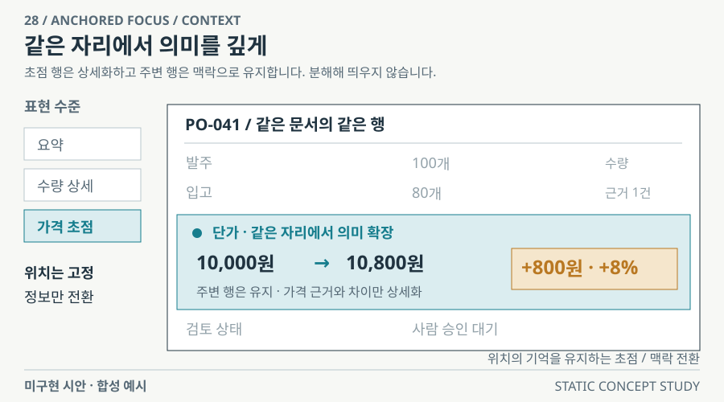

**적용 구상:** dSense 연구의 초점·맥락 접근에서 착안해 문서 행의 위치를 고정한 채 요약·수량·가격 표현 수준을 바꾸는 독자적 구상입니다.

**선택 시 주의점:** 웹에서 새로 구현해야 하는 연구 방법입니다. 모든 정보가 실제 공간 좌표와 연결되지 않으면 층 은유가 억지스러울 수 있습니다.

## 29 · 확대할수록 사건이 열리는 시간 지도

**참고작:** [Timeline Traveler · The Race to the Moon](https://www.timelinetraveler.com/timeline/race-to-the-moon-timeline) · [상세 후보 문서](../candidates/29.md)

[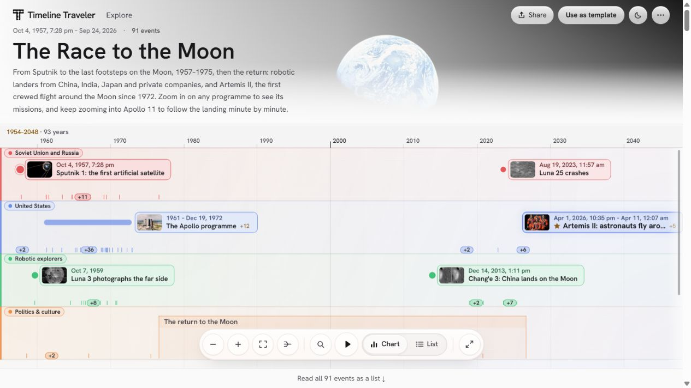](../images/29-reference.png)

**화면에서 볼 부분:** 평행한 주체별 레인에 긴 프로그램과 짧은 사건을 배치합니다. 전체 기간·확대·목록 보기와 중첩 사건이 연결됩니다.

**표현 원리:** 시간 척도에 따라 정보 수준을 바꾸는 계층 시간 탐색

**어울리는 업무:** 프로젝트 이력·운영 사건·대규모 일정 검토

**기존 후보와의 차이:** 08은 실행의 소요 시간을 분석하고10은 시계열 신호를 읽습니다. 29는 프로젝트→작업→사건으로 시간 정보의 수준을 확대합니다.

**직접 확인한 조작과 한계:** 공개91사건 예제를 열고 Zoom in을 두 번 눌러 시간 범위가 좁아지는 것을 확인했습니다. 캡처는 전체 흐름이 읽히는 초기 전체 범위입니다. 예제의 역사 사실은 검증 대상이 아닙니다.

같은 번호의 자체 적용 시안 보기 · 미구현

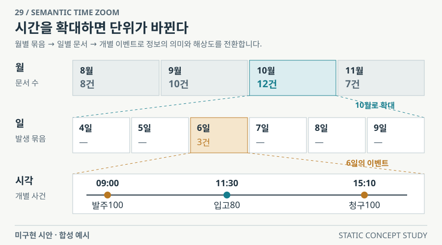

**적용 구상:** 문서가 발생한 시간을 월·일·이벤트 수준으로 탐색합니다. PO와 입고, 청구의 순서를 상세 단계에서 비교하는 구상입니다.

**선택 시 주의점:** 확대 중심이 잘못 잡히면 빈 기간이 보입니다. 검색·선택 사건에 맞춤·현재 범위 안내가 필요합니다.

## 30 · 문서를 자유롭게 놓는 비교 작업 공간

**참고작:** [Mirador · IIIF viewer demo](https://projectmirador.org/demo/) · [상세 후보 문서](../candidates/30.md)

[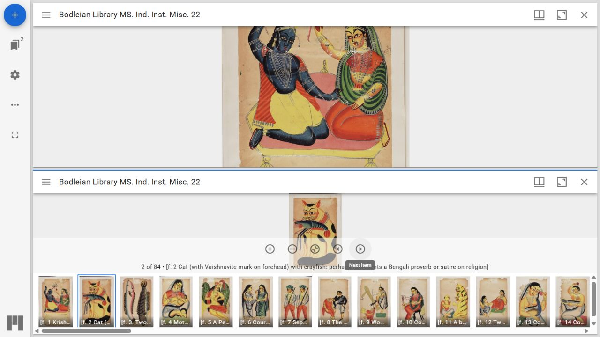](../images/30-reference.png)

**화면에서 볼 부분:** 여러 이미지 문서를 각 창으로 열고 페이지·썸네일·확대를 독립적으로 조작합니다. 자료를 추가하거나 닫으면 창 배치가 바뀝니다.

**표현 원리:** 문서 선택과 창 배치를 사용자가 구성하는 연구 작업 공간

**어울리는 업무:** 증빙 대조·이미지 아카이브·다중 자료 검토

**기존 후보와의 차이:** 09는 고정된 두 버전의 변경 비교입니다. 30은 사용자가 자료·페이지·창 개수를 구성해 자유롭게 조사합니다.

**직접 확인한 조작과 한계:** 공개 Bodleian 자료를 창으로 추가하고 각기1/84·2/84페이지를 열어 배치했습니다. 최초 다른 자료의 이미지 로딩 실패도 있어 캡처에는 로드된 공개 자료만 사용했습니다.

같은 번호의 자체 적용 시안 보기 · 미구현

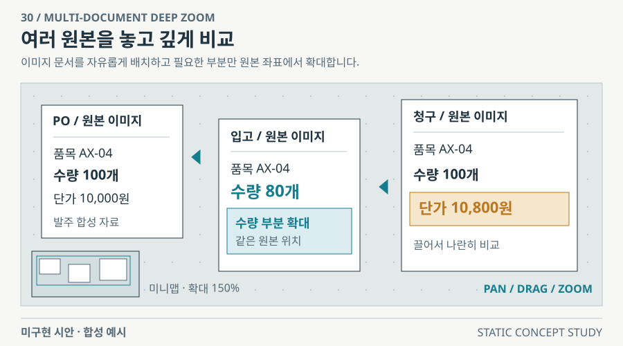

**적용 구상:** 발주·입고·청구의 합성 문서 이미지를 하나의 넓은 작업 공간에 배치합니다. 수량과 단가가 있는 부분을 확대해 나란히 대조하는 구상입니다.

**선택 시 주의점:** 많은 창은 읽기 크기를 줄입니다. IIIF 자료 접근·이미지 서버·권리에 의존하며 정답 판정을 대신하지 않습니다.

## 31 · 측정 점을 분류하며 보는 기술 장면

**참고작:** [OpenGeos · LiDAR Point Cloud Viewer](https://lidar-viewer.gishub.org/?url=https://s3.amazonaws.com/hobu-lidar/autzen-classified.copc.laz) · [상세 후보 문서](../candidates/31.md)

[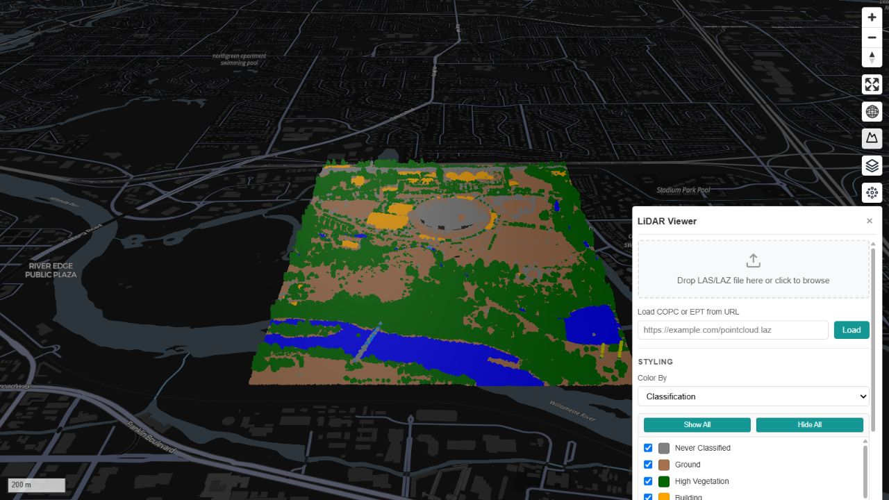](../images/31-reference.png)

**화면에서 볼 부분:** 공개 경기장 점군을 지도 위3D 점으로 표시합니다. 높이와 분류 등의 표시 기준을 바꾸고 의미 범주별 표시를 조정합니다.

**표현 원리:** 형태와 측정값·분류를 연결하는 점군 검사

**어울리는 업무:** 공간 측정·설비 현황·센서 데이터·현장 검사

**기존 후보와의 차이:** 01·03은 이해를 돕는 물체 모형입니다. 31은 측정된 점 자체가 데이터이며 색·필터가 측정 속성에 연결됩니다.

**직접 확인한 조작과 한계:** Autzen 공개 COPC 샘플이 로드되고 표시상10,653,336points를 확인했습니다. Color By를 Elevation에서Classification으로 바꾸자 범주 체크박스와 색이 바뀌었습니다. 측정 정확도는 검증하지 않았습니다.

같은 번호의 자체 적용 시안 보기 · 미구현

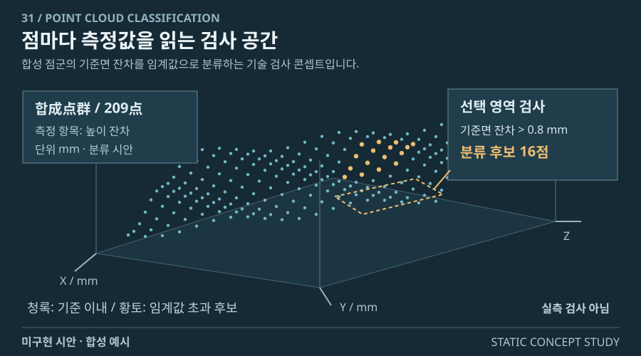

**적용 구상:** 합성 점군을 공간 좌표와 높이 잔차로 표현해 임계값 초과 영역을 분류하는 구상입니다. 문서 대조와 별도의 기술 검사 방식 확장안입니다.

**선택 시 주의점:** GPU·대용량 스트리밍·좌표 보정 부담이 큽니다. 실제 공간 데이터가 없는 문서 업무에 억지로 적용하지 않습니다.

## 32 · 한 번에 두 기준만 판단하는 의사결정

**참고작:** [Pairwise · Comparison Tool](https://compare.gbrlpzz.com/) · [상세 후보 문서](../candidates/32.md)

[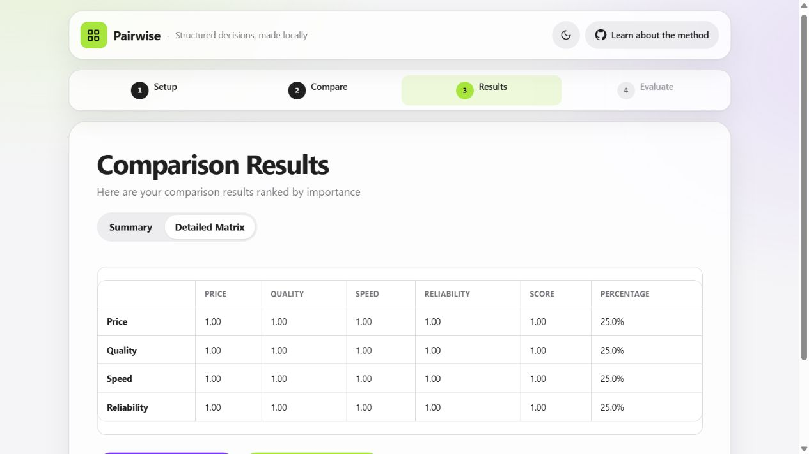](../images/32-reference.png)

**화면에서 볼 부분:** 기준 입력→두 기준의 중요도 판단→가중치→상세 행렬을 순서대로 엽니다. 진행률과 이전 판단으로 돌아가기가 함께 보입니다.

**표현 원리:** 복잡한 선호 판단을 작은 쌍의 결정으로 나누는 흐름

**어울리는 업무:** 도입 우선순위·대안 평가·합의 워크숍

**기존 후보와의 차이:** 09·22는 데이터 차이를 비교합니다. 32는 비교 기준의 중요도를 사용자가 직접 만들고 행렬로 검토하는 결정 과정입니다.

**직접 확인한 조작과 한계:** Try an example의4기준6쌍을 모두Equal로 입력해 각25%가 나온 결과와Detailed Matrix를 확인했습니다. 예시 입력 결과이며 일반적인 추천 정확도를 검증한 것이 아닙니다.

같은 번호의 자체 적용 시안 보기 · 미구현

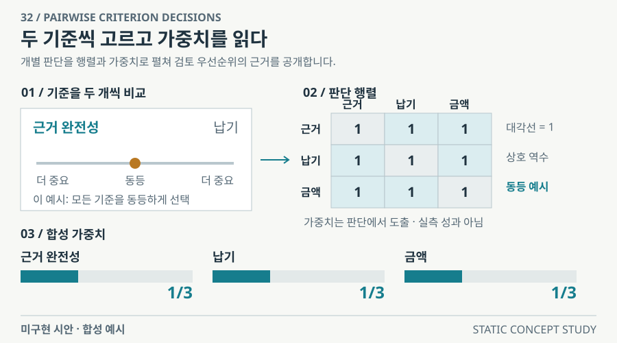

**적용 구상:** 근거 완전성·납기·금액을 두 개씩 비교한 판단으로 우선순위 가중치를 만드는 구상입니다. 시안은 모든 기준을 동등하게 둔 합성 예시입니다.

**선택 시 주의점:** 기준 수가 늘면 비교 쌍이 급증합니다. 가중치가 객관적인 우열이나 최적의 사업 결과를 보장하지 않습니다.

## 재사용할 때

색상·장식을 그대로 복제하기보다 사용자가 판단할 대상과 실제 입력·규칙·상태·결과에 맞는 원리를 선택하세요. 해당 업무와 관계없는 입체 모형이나 임의 수치를 넣는 것은 이 자료의 목적이 아닙니다.

다른 세션에는 저장소 주소 또는 클론한 폴더와 함께 **후보 번호 + 가져올 원리 + 핵심 업무**를 전달하세요. [요청문 예시](../NEW_SESSION_PROMPT.md)를 사용할 수 있습니다.

참고 이미지의 권리는 원작자에게 있습니다. 자체 코드·문서·SVG의 라이선스와 외부 캡처의 사용 조건은 [NOTICE.md](../NOTICE.md)에서 구분합니다. 확인 기준일: 2026-10-09.
