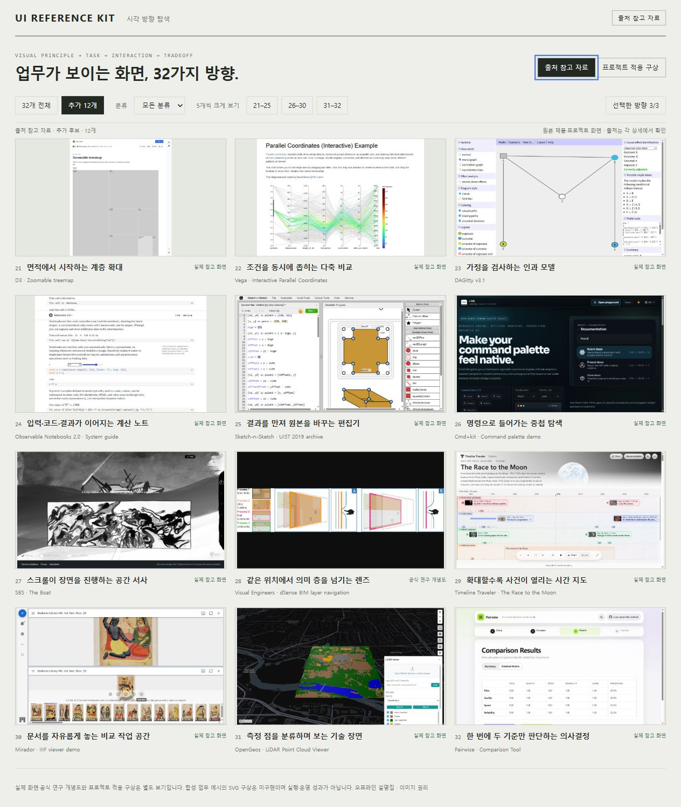
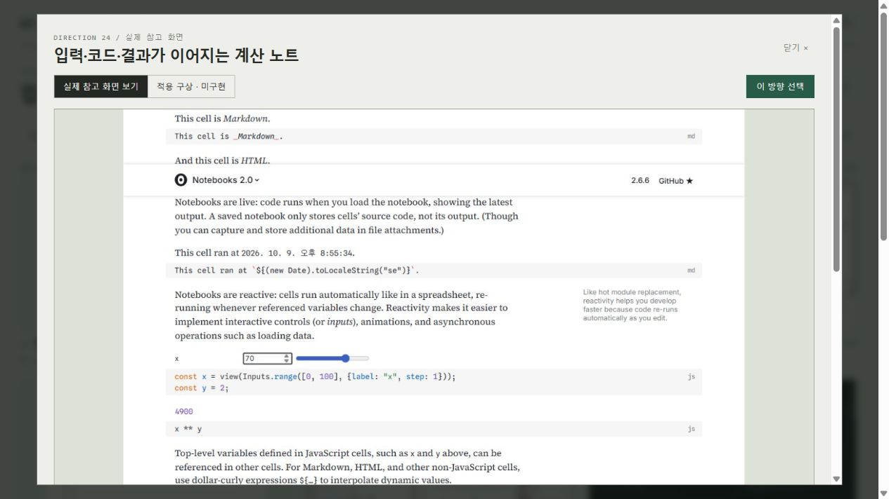
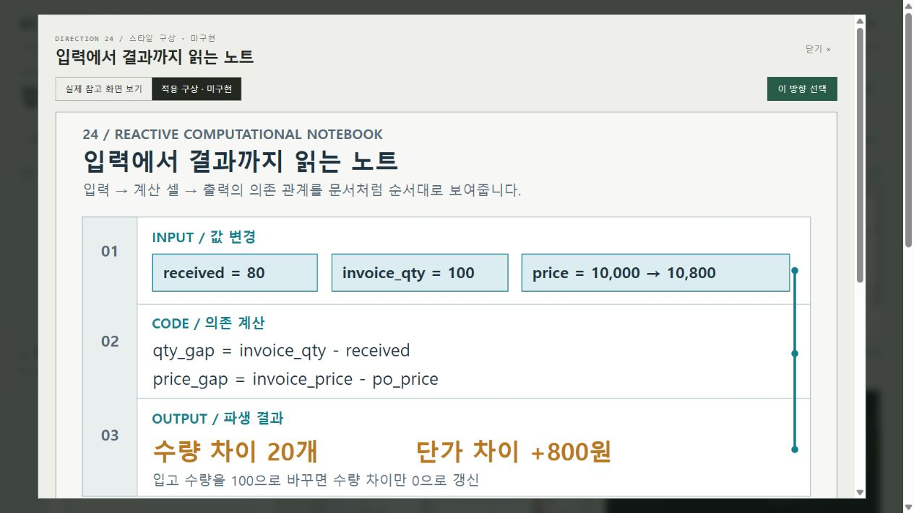

# 선택 갤러리 · 실행 화면과 사용 순서

[README로 돌아가기](../README.md) · [추가 12개 사진 해설집](EXPANDED_STYLES.md)

2026-10-09에 로컬 서버에서 실행한 갤러리를 브라우저로 캡처했습니다. 원작의 기능은 후보별 원본 사이트에서 확인한 것이며, 이 갤러리는 사진·설명·자체 시안을 비교하고 선택하는 도구입니다.

## 1. 신규 후보만 비교하기

서버 실행 후 `/gallery/index.html#new`를 열거나 **추가 12개**를 누릅니다. **21–25 / 26–30 / 31–32**를 누르면 적은 수의 후보를 크게 비교할 수 있습니다. 분류로 좁힌 뒤 사진을 눌러 상세 설명을 엽니다.



캡처 전에 12개 이미지가 모두 로딩된 것을 확인했습니다. 기본 선택은 기존 03·05·19이며, 이 선택을 모든 프로젝트에 그대로 적용할 필요는 없습니다.

## 2. 원본에서 표현 원리 확인하기

24번 상세 화면의 **실제 참고 화면 보기**입니다. Observable 공식 가이드에서 입력·코드·출력을 함께 읽는 방법을 가져왔습니다. 상세 영역을 아래로 스크롤하면 적합 업무·기존 후보와의 차이·조작 확인·주의점·원본 출처를 읽을 수 있습니다.



이 이미지는 상세 창의 상단 표시 영역 캡처입니다. 원본 사진은 [24-reference.png](../images/24-reference.png)에 포함돼 있습니다.

## 3. 같은 번호의 자체 시안과 비교하기

**적용 구상 · 미구현**으로 전환한 화면입니다. 입력 → 계산 → 결과의 배치를 합성 업무 예시로 구성했습니다. 이 SVG 내부의 입력 변경·재계산은 제안된 조작이며, 갤러리에서 실제 업무 계산으로 실행되지는 않습니다.



## 4. 선택하고 다른 세션에 전달하기

**이 방향 선택**을 누르면 최대 3개를 고를 수 있습니다. 선택은 해당 브라우저의 localStorage에 저장됩니다. 다른 사람이나 AI 세션에는 후보 번호와 가져올 원리를 직접 전달하세요.

```text
ui-reference-kit의 24·29·30을 직접 확인해 주세요.
24의 계산 과정 공개, 29의 시간 척도별 상세 보기,
30의 여러 원문 비교를 우리 업무에 적용할 수 있는지 검토해 주세요.
정적인 시안과 실제 실행 기능은 구분해 주세요.
```

실행 명령·포트 변경·오프라인 읽기·문제 해결은 [README](../README.md)에 있습니다. 외부 참고 화면이 포함된 캡처의 권리 구분은 [NOTICE.md](../NOTICE.md)를 따릅니다.
